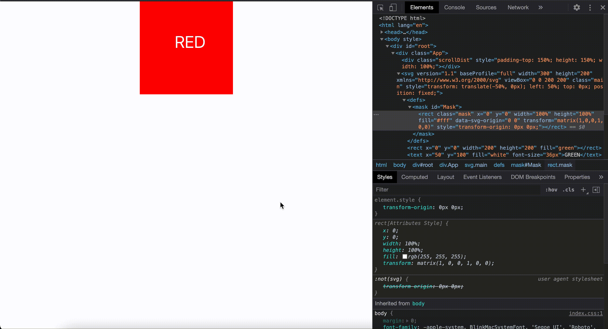

こんにちは。  
本日のトピックは ScrollTriger を用いた Parallax です。  
Parallax ってかっこいいですよね。  
ポートフォリオは[こんな感じ](https://kuon.space/)を参考に作りたいなと思っていたりするので、  
実装方法が気になるところです。それにしてもこのサイトめちゃくちゃかっこいいですね！

#### Parallax とは

Parallax とは、二次元の画像でいくつかのレイヤーを作ることで、立体的に見せる手法です。  
昔のゲーム（ファミコンやメガドライブ）などでも使われていた手法みたいですね。  
Wikipedia では下記のとおり。

> 視差スクロールは、背景画像が前景画像よりもゆっくりとカメラを通過し、  
> 距離の 2D シーンに奥行きのある錯覚を作り出すコンピュータグラフィックスの手法です(Google 翻訳)


#### ScrollTrigger とは

ScrollTrigger とは、アニメーションライブラリ [GSAP（GreenSock Animation Platform）](https://greensock.com/gsap/)で  
提供されるプラグインのひとつです。  
特定の要素に個別アニメーションを設定できたりかなり自由度が高いらしいです。  
今回は、Youtube の[この動画](https://www.youtube.com/watch?v=2ZD7kElwHss)を参考に React で作成していきます。

#### React での実装

React での実装については、日本語で解説されている[こちらのブログ](https://serip39.hatenablog.com/entry/2020/12/21/190000)を参考にさせていただいています。やっぱりエンジニアは英語の免疫をつけていかないと、ドキュメント読むの大変ですね。。。

##### インストール

```bash:title=npm
npm install gsap
```

##### 使い方

インポートして、`gsap.registerPlugin`メソッドで登録する必要があるらしいです。  
下記では、`timeline`でタイムライン制御を定義し、`fromTo`で A→B の状態を定義しています。

```js:title=index.js
import { gsap } from 'gsap'
import { ScrollTrigger } from 'gsap/ScrollTrigger'

gsap.registerPlugin(ScrollTrigger)

useEffect(() => {
    setAnimation()
}, [])

const setAnimation = () => {
    gsap.timeline({
      scrollTrigger: {
      trigger: "#トリガーの要素",
        start: "top top",     //開始時のトリガー条件
        end: "bottom bottom", //終了時のトリガー条件
      },
    })
    .fromTo("#アニメーションさせたい要素", { y: 0 }, { y: -200 }, 0)
}
```

#### SVG

今回は SVG を使うので、メモをば。
詳しくは、[MDN](https://developer.mozilla.org/ja/docs/Web/SVG/Tutorial/Clipping_and_masking)がわかりやすいです。

- `svg`タグ: ルート要素。レンダリング順序は、svg 内の「後の要素が前の要素の上」に描画されます。
- `g`タグ: グループ化のタグ。配下の要素の全体にプロパティを割り当てることができます。
- `mask`タグ: mask を定義するタグ。
- `<g mask='url(#m)'>`: グループに mask を適用させている。mask の範囲のみ描画される。

##### mask タグを使ったアニメーション

さて、上記の例だとどうやって画面が切り替わっているのかがわからりにくいので、  
別にサンプルを作成してみました。  
`svg`内では後に置いた要素が上にかぶさるため、  
`mask`のプロパティが設定されている赤いグループが、上にかぶさっていて、  
緑色のグループがその下に配置されています。

```js:title=example
import "./App.css";
import { gsap } from "gsap";
import { ScrollTrigger } from "gsap/ScrollTrigger";
import { useEffect } from "react";

function App() {
  useEffect(() => {
    gsap.registerPlugin(ScrollTrigger);
    setAnimation();
  }, []);

  function setAnimation() {
    gsap.set(".main", {
      position: "fixed",
      top: 0,
      left: "50%",
      x: "-50%",
    });
    gsap.set(".scrollDist", {
      width: "100%",
      height: "150%",
      paddingTop: "150%",
    });

    gsap
      .timeline({
        scrollTrigger: {
          trigger: ".scrollDist",
          start: "top top",
          end: "bottom bottom",
          scrub: 1,
        },
      })
      .fromTo(".mask", { y: 0 }, { y: -200 }, 0);
  }

  return (
    <div className='App'>
      <div className='scrollDist'></div>
      <svg
        version='1.1'
        baseProfile='full'
        width='300'
        height='200'
        xmlns='http://www.w3.org/2000/svg'
        viewBox='0 0 200 200'
        className='main'
      >
        <defs>
          <mask id='Mask'>
            <rect
              className='mask'
              x='0'
              y='0'
              width='100%'
              height='100%'
              fill='#fff'
            />
          </mask>
        </defs>

        <g> //下のグループ
          <rect x='0' y='0' width='200' height='200' fill='green' />
          <text x='50' y='100' fill='white' fontSize='36px'>
            GREEN
          </text>
        </g>

        <g mask='url(#Mask)'> //上のグループ
          <rect x='0' y='0' width='200' height='200' fill='red' />
          <text x='75' y='100' fill='white' fontSize='36px'>
            RED
          </text>
        </g>
      </svg>
    </div>
  );
}

export default App;
```

`gsap.set`では、指定のクラスにスタイルを適応しています。  
そして、`scrollDist`をトリガーに、アニメーションを当てています。



アニメーションは、`mask`の部分です。  
動画で`transform`の高さの値が変化していることがわかります。  
この値が変化することで、`mask`がかぶさっている部分のみ描画されるため、  
シームレスに要素が入れ替わっているように見えます。

```js:title=mask
      .fromTo(".mask", { y: 0 }, { y: -200 }, 0);
```

#### サンプル実装

ということで、実際に[この動画](https://www.youtube.com/watch?v=2ZD7kElwHss)を参考に実装してみました。

```js:title=App.js
import "./App.css";
import { gsap } from "gsap";
import { ScrollTrigger } from "gsap/ScrollTrigger";

import cloud1 from "./img/cloud1.png";
import cloud1Mask from "./img/cloud1Mask.jpg";
import cloud2 from "./img/cloud2.png";
import cloud3 from "./img/cloud3.png";
import mountBg from "./img/mountBg.png";
import mountFg from "./img/mountFg.png";
import mountMg from "./img/mountMg.png";
import sky from "./img/sky.jpg";
import { useEffect } from "react";

function App() {
  useEffect(() => {
    gsap.registerPlugin(ScrollTrigger);
    setAnimation();
  }, []);

  function setAnimation() {
    gsap.set(".main", {
      position: "fixed",
      background: "#fff",
      width: "100%",
      maxWidth: "1200px",
      height: "100%",
      top: 0,
      left: "50%",
      x: "-50%",
    });
    gsap.set(".scrollDist", {
      width: "100%",
      height: "150%",
      paddingTop: "150%",
    });
    gsap
      .timeline({
        scrollTrigger: {
          trigger: ".scrollDist",
          start: "top top",
          end: "bottom bottom",
          scrub: 1,
        },
      })
      .fromTo(".sky", { y: 0 }, { y: -200 }, 0)
      .fromTo(".cloud1", { y: 100 }, { y: -800 }, 0)
      .fromTo(".cloud2", { y: -150 }, { y: -500 }, 0)
      .fromTo(".cloud3", { y: -50 }, { y: -650 }, 0)
      .fromTo(".mountBg", { y: -10 }, { y: -100 }, 0)
      .fromTo(".mountMg", { y: -30 }, { y: -250 }, 0)
      .fromTo(".mountFg", { y: -50 }, { y: -600 }, 0);
  }

  return (
    <div className='App'>
      <div className='scrollDist'></div>
      <div className='main'>
        <svg viewBox=' 0 0 1200 800'>
          <mask id='m'>
            <g className='cloud1'>
              <rect fill='#fff' width='100%' height='801' y='799' />
              <image href={cloud1Mask} width='100%' height='800' />
            </g>
          </mask>

          <image className='sky' href={sky} width='1200' height='590' />
          <image className='mountBg' href={mountBg} width='1200' height='800' />
          <image className='mountMg' href={mountMg} width='1200' height='800' />
          <image className='cloud2' href={cloud2} width='1200' height='800' />
          <image className='mountFg' href={mountFg} width='1200' height='800' />
          <image className='cloud1' href={cloud1} width='1200' height='800' />
          <image className='cloud3' href={cloud3} width='1200' height='800' />
          <text fill='#fff' x='320' y='220'>
            PARALLAX
          </text>

          <g mask='url(#m)'>
            <rect fill='#fff' width='100%' height='100%' />
            <text x='350' y='200' fill='#162a43'>
              FURTHER
            </text>
          </g>
        </svg>
      </div>
    </div>
  );
}

export default App;
```

#### 完成品

完成品です。スタイルは元の動画のままなので割愛します。  
実装というより、素材の使い方のほうがセンスが必要な予感がしますね。  
それにしてもかっこいい！次回はカーソルに反応する Parallax をやってみたいと思います。


#### 参考

- [KUON YAGI PORTFOLIO](https://kuon.space/).
- [Parallax scrolling](https://en.wikipedia.org/wiki/Parallax_scrolling).
- [GSAP](https://greensock.com/gsap/).
- [ScrollTrigger](https://greensock.com/scrolltrigger/).
- [Amazing Parallax Scrolling Effect Using GSAP's Animation ScrollTrigger](https://www.youtube.com/watch?v=2ZD7kElwHss).
- [【React】React + GSAP（ScrollTrigger）でスクロールアニメーションを実装する（Next.js）](https://serip39.hatenablog.com/entry/2020/12/21/190000).
- [MDN:クリッピングとマスキング](https://developer.mozilla.org/ja/docs/Web/SVG/Tutorial/Clipping_and_masking).
- [transform:matrix() …… 行列を使用して要素に 2D 変形を適用する](http://www.htmq.com/css3/transform_matrix.shtml).
