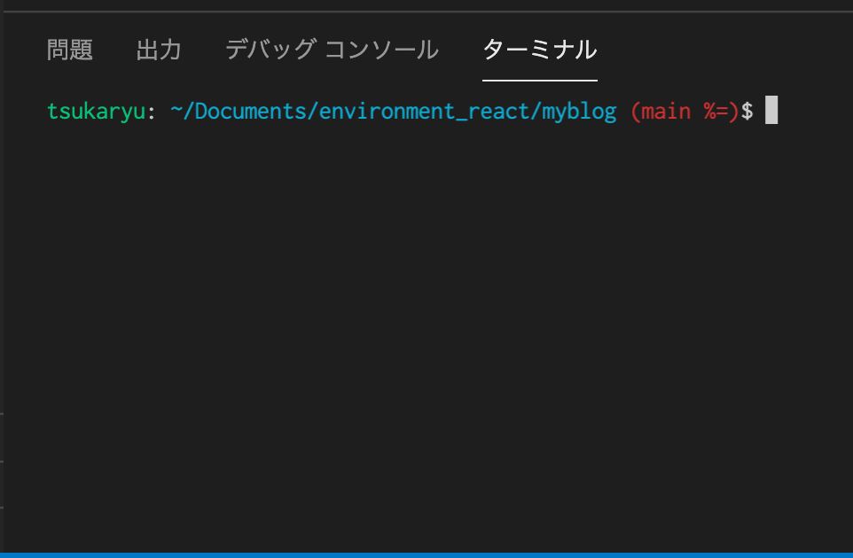

こんにちは。今回は mac のターミナルについてです。  
Udemy の TypeScript 入門を見始めたら、git のブランチがターミナルで表示されていて、  
うらやましかったので自分も導入してみました。

やり方はこちらを参照しました ↓  
[【zsh】絶対やるべき！ターミナルで git のブランチ名を表示&補完【git-prompt / git-completion】](https://qiita.com/mikan3rd/items/d41a8ca26523f950ea9d)

表示名が長すぎるのと、`$`が改行されるのが気に入らなかったので、そこだけ変えました。

```bash:title=.zshrc
# プロンプトの表示設定(好きなようにカスタマイズ可)
# 変更前
setopt PROMPT_SUBST ; PS1='%F{green}%n@%m%f: %F{cyan}%~%f %F{red}$(__git_ps1 "(%s)")%f
\$ '

# 変更後
setopt PROMPT_SUBST ; PS1='%F{green}[ユーザ名]%f: %F{cyan}%~%f %F{red}$(__git_ps1 "(%s)")%f\$ '
```

いい感じです。


