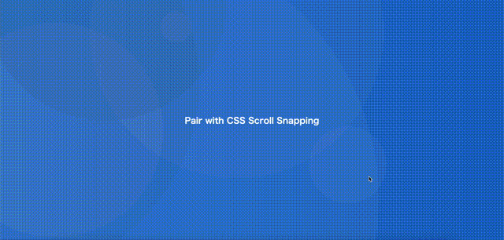

こんにちは。今回は、CSS Scroll Snapping についてです。  
１カラムのサイトで、少しスクロールしたら、次の要素に自動的に動いてくれるあれです。  
かっこいいポートフォリオや LP にはたいてい入っていてどうやるんだろうと思ってました。

GSAP の[ScrollTrigger Demos](https://greensock.com/st-demos/)に[CSS Scroll Snapping](https://codepen.io/GreenSock/pen/YzyaKrq)というのがあったので、  
React で書いてみました。

##### 完成版



#### scroll-snap-type

Scroll Snapping ですが、JavaScript かと思いきや、CSS で設定すれば実現できるものでした。  
CSS 便利ですねー。ちょっとびっくり。

使い方もかんたんで、親子関係にある要素に対して、下記のプロパティを設定するだけです。  
下記の例だと、y 軸方向に snap するような構造を作ることが出来ます。  
ちなみに`mandatory`は強制するという意味で、その名の通り、  
少しスクロールすると、次の要素まで強制的に移動してくれます。  
ほしかったのこれだ！

```css:title=親
  scroll-snap-type: y mandatory;
```

```css:title=子
  scroll-snap-align: start;
```

#### CSS Scroll Snapping

React での Scroll Trigger の使い方は[前回](/2021-04-15_how-to-use-gsap-react/)記載のとおりです。  
というわけで、実際に実装してみました。  
useEffect でそれぞれの要素に達したらアニメーションが発火するようにしています。

```js:title=App.js
import React, { useRef, useEffect } from 'react';
import './App.css';
import { gsap } from 'gsap';
import { ScrollTrigger } from 'gsap/ScrollTrigger';

function App() {
  gsap.registerPlugin(ScrollTrigger);
  ScrollTrigger.defaults({
    toggleActions: 'restart pause resume pause',
  });
  const ref = useRef(null);

  useEffect(() => {
    const element = ref.current;
    gsap.to(element.querySelector('.orange p'), {
      scrollTrigger: '.orange',
      duration: 2,
      rotation: 360,
    });
  }, []);

  useEffect(() => {
    const element = ref.current;
    gsap.to(element.querySelector('.red'), {
      scrollTrigger: {
        trigger: '.red',
        toggleActions: 'restart pause reverse pause',
      },
      duration: 1,
      backgroundColor: '#FFA500',
      ease: 'none',
    });
  }, []);

  useEffect(() => {
    const element = ref.current;
    gsap.to(element.querySelector('.yoyo p'), {
      scrollTrigger: '.yoyo',
      scale: 2,
      repeat: -1,
      yoyo: true,
      ease: 'power2',
    });
  }, []);

  return (
    <div className='App' ref={ref}>
      <section className='panel blue'>
        <h1>Pair with CSS Scroll Snapping</h1>
      </section>

      <section className='panel orange'>
        <p>This element will spin.</p>
      </section>

      <section className='panel red'>
        <p>This background color will change</p>
      </section>

      <section className='panel blue yoyo'>
        <p>Yoyo Text!</p>
      </section>
    </div>
  );
}

export default App;
```

見映を例と合わせるために、少し CSS を記載しています。  
よくわからなかったのが、`scroll-snap-type: y mandatory;`を `html` 要素に対してあてると、  
問題なく動くのですが、親要素である`.App`にあてると反応しないんですよね。  
create-react-app の問題かと思って、MDN のサンプルなんかやってみましたが、  
正常に作動しました。一体何が悪いのやら。。。

```css:title=App.css
html {
  scroll-snap-type: y mandatory;
}

/* .App { // こちらで設定しても動作しない
  scroll-snap-type: y mandatory;
} */

section {
  display: flex;
  justify-content: center;
  align-items: center;
}

.panel {
  scroll-snap-align: start;
  overflow-y: scroll;
  height: 100vh;
}

.red {
  background-color: #cf3535;
  background-image: none;
}

.panel h1 {
  color: white;
}

.panel p {
  font-size: 32px;
}

.blue {
  background-color: hsl(212, 65%, 50%);
}

.orange {
  background-color: #e77614;
}
/* 一部省略 */
```

#### 最後に

GSAP のサンプルを見てると、レベルが高いものが多すぎて、  
どういうサイトを作ればいいのか思い悩みだしちゃいますね。  
あとは、Barba.js のページトランジションができればいいかなー。

そこらへんを眺めつつ、コンセプトとデザインと組み込みたい要素を考えて、  
ざっくり設計していきたいと思います。

#### 参考

- [ScrollTrigger Demos](https://greensock.com/st-demos/).
- [CSS Scroll Snapping](https://codepen.io/GreenSock/pen/YzyaKrq).
- [scroll-snap-type](https://developer.mozilla.org/ja/docs/Web/CSS/scroll-snap-type).
- [CSS のスクロールスナップの便利な使い方、実装の注意点を徹底解説](https://coliss.com/articles/build-websites/operation/css/usecase-of-css-scroll-snap.html).
