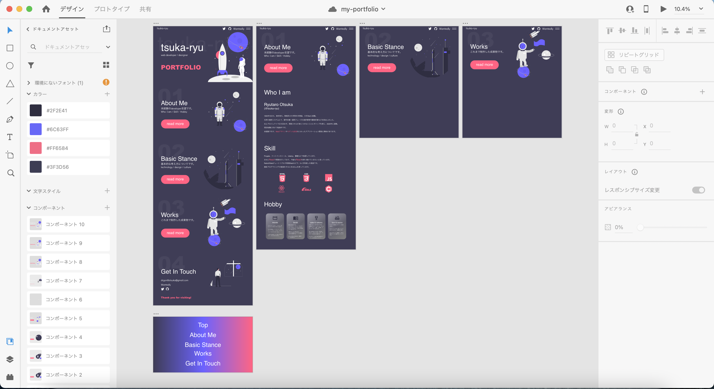

こんにちは。  
ここ数日体調を崩して何もしていなかったのですが、  
少し回復したので、Portfolio サイトを作り始めました。

書く内容はこんな感じかなとそうそうに決まったのですが、  
肝心なデザインをどうしたものかと途方に暮れて結構時間を食いました。

参考にしているいくつかのポートフォリオのレイアウトを真似しつつ、  
[undraw](https://undraw.co/)の素敵なイラストを配置したらそれっぽくなってよかったです。

##### いまこんな感じ

どうしても Parallax をやりたかったので、宇宙っぽいイラストのイメージで固めてみました。  
まだ Adobe XD でモックを作っている段階です。  
デザインさえ決まれば、それなりに実装でやることはわかっているので、  
今日明日にはデザインを完成させたいです。

全体としても、今週中には完成させたいです！  
来週からはまた別のアプリ構築したい！けどやる気がなかなか続かない！（笑）
