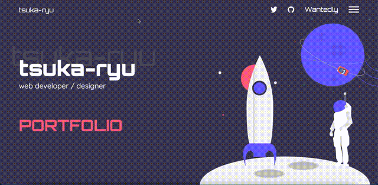

こんにちは。  
Portfolio サイトの続報です。  
ひとまず、HTML と CSS をガシガシ書いて、ちょこっと Parallax を実装してみました。  
scroll-snapping なんかもついて、個人的にはとてもいい感じです。

ただ、実際実装してみると、画面的に地味かな〜とか思い始めています。  
アニメーションできらきら星でも振らせようかなという感じです。

いったんは、今のデザインのまま、実装進めて後で考えたいと思います。

あと２ページ分ガシガシ作ったら、次はレスポンシブ対応して、  
それからアニメーションつけて、ナビゲーションのモーダルウィンドウつけて、  
といった流れでしょうか。

今週完成予定だったけど、全然無理そうですね。笑  
作業時間的にはそんなにかかってないのですが、  
作業着手までの無駄な時間の多いこと。。。  
地道にやっていくしかないですね。
