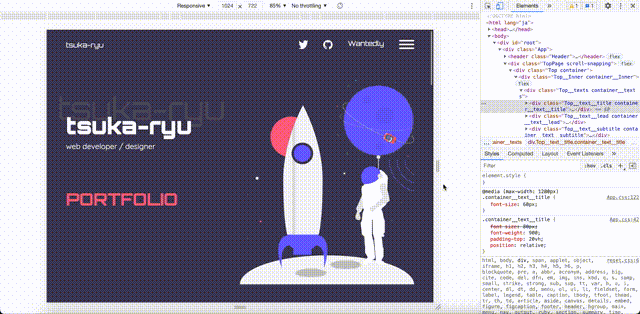

こんにちは。  
今日はレスポンシブ対応をやってみました。  
（レスポンシブル responsible だと思っていたのですが、レスポンシブ responsive なんですね）

コンポーネントごとに CSS をぐちゃぐちゃ書いていたせいで、レスポンシブ対応もカオスに。。。  
フォントサイズやパッディングなど、ある程度共通化できるものは、  
Sass で部品化する(`font-sm`みたいなクラスを作って、画面幅ごとに変数にする？)のが最適解な気もします。CSS をいい感じに書く方法が知りたいです。

そもそも、React の場合、ファイル一つのほうがいいのか、コンポーネントごとがいいのか、  
CSSModule か、否かとか選択肢がいろいろあって、どうするのがいいのか迷います。  
べすとぷらくてぃすとかいうのを勉強すべきなのでしょうか。

微妙な感じですが、キリがないので、明日からはアニメーションに着手します。  
楽しそうなパートでわくわく。
