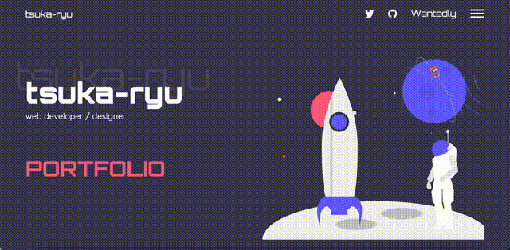

こんにちは。  
今日もポートフォリオの進捗報告です。  
アニメーションを付与するところから進めて、グローバルメニューなども実装した上で、  
ひとまずスマホでも触れるようにデプロイしました！地味に達成感！



アニメーションどうやって付与するんだ〜とか、barba.js 使いて〜とか、  
いろいろ紆余曲折あったのですが、都度解決していた結果、何をしたか忘れました笑。  
きれいにブランチ切っていればよかったんでしょうけど、GSAP と[このサイト](https://medium.com/swlh/react-spa-routing-transition-with-barba-js-effect-aee77da832f4)を参考にした記憶はあります。

#### 現時点での反省

実装していて現時点での反省についてのメモしておきます。  
今回は React での実装というより、HTML/CSS のコーディングと GSAP がメインだったので、  
そこまで躓くポイントはなかったのですが、それでも課題は山積みですね。

##### デザインやり直したい問題

サイトの印象ってデザインですべてが決まるみたいなところあると思うのですが、  
今回作ったサイトはかなり不満だらけです。  
事前に Adobe XD でフォントやマージンまで調整していたはずなのですが、  
実際にコーディングしてみると、うまく調整できない事が多かったです。

これは単純に、XD を使いこなせず、作り込みが甘かったなと言う感想です。  
事前に、画面幅をスマホ用、デスクトップ PC のいくつかで作っておけばよかったかな。

あと、レスポンシブを意識したデザイン、みたいのができると、  
余計な CSS を書かなくていいので、いいなあと思いました。  
今回はかなりぐっちゃぐちゃに CSS を書きまくっているので、保守性を考えると恐ろしいです。  
実際、さっきスマホからアクセスしたら、かなり見づらいレイアウトでした・・・

今のモチベーションとしては、面白いアプリケーションを作るより、  
おしゃれな LP 作りたい感じなので、Web デザイナー的な方向でしょうか。  
道のりは長いですね。

今後の課題：Adobe XD をちゃんと Udemy か本で勉強、レスポンシブ意識する

##### 実装段取れない問題

いま現在、実装作業のボリュームと作業時間があまり良くわかりません。  
作成中のサイトも、本来は 4/24 までに完成の予定だったのですが、  
作業しなかった日も結構あり、全然終わりませんでしたね。  
実作業は５日間くらいでしょうか。たぶん。。。

はじめの段取りはざっくり下記の通りでした。

```
- デザイン
- マークダウン
- スタイリング
- レスポンシブ対応
- アニメーション
- 細かい修正
```

おおむね、この通りに作業したのですが、かなり手戻りもありました。  
特に、あとでレスポンシブ対応するからいっか、とゴリゴリ CSS を書いたのがよくなくて、  
HTML/CSS に７割位時間を割いた気がします。  
というか、そこで力尽きてしまって、アニメーションはあんまり凝ったことしてないですね。

あと、マークダウンやスタイリングのときに、下記２点がしっくりこず、  
作業しながらかなりもやもやしていました。

1. 命名法どうするか
1. 分割粒度をどうするか

コンポーネントに変な名前つけちゃうから、クラス名も変な名前になり、  
コンポーネントがうまく分割できないから、スタイリングをどこに書いたらいいかわからない。  
みたいな、ことが多々ありました。

BEM とか、コンポーネント分割の考え方みたいなのを探したいです。  
React 公式には、コンポーネントは分割すればするほどいい（語弊ありそうですが）  
みたいに書いてありましたが、スタイリングのこと考えると本当にそうなのかわかりません。  
（例えば、position:relative を設定した際のコンテキストを見失うとか、クラス単位のアニメーション管理しづらいとか）

そういうのってどうやって勉強したらいいんですかね。  
概念的なことを説明している本とかなのかな。

今後の課題：クラスやファイルの命名法、コンポーネント分割について学ぶ

#### 最後に

今回のポートフォリオは大した機能もないので、デザインが重要だなという印象が強いです。  
次回は、firebase を使った Web アプリを構築予定なので、デザイン面は Semantic UI を使うことで、  
無駄を省いていきたいとは思っています。  
機能面では、あんまり Javascript 書いてないので、Udemy でまた復習しながらやろうと思います。  
firebase の下りとか全く覚えてない。。。

それにしても、自分でものを作るのは楽しいです。  
全く作業しない日と、ずっと作業する日にわかれてしまっているので、  
習慣的にコーディングする毎日コツコツタイプになりたいですね。

#### 参考

- [GSAP 3 Cheat Sheet](https://greensock.com/cheatsheet/).
- [React SPA Routing Transition With Barba.Js Effect](https://medium.com/swlh/react-spa-routing-transition-with-barba-js-effect-aee77da832f4).
