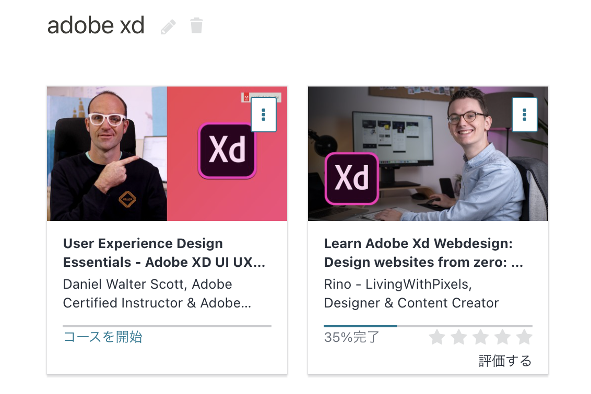

こんにちは。  
GW で Udemy がセールをやっていたので、Adobe 関連の講座をいくつか買ってみました。  
今日はその中で Adobe XD の講座をやってみています。  
（とりあえず右側から。どっちもなんかおもしろ外人感あっていいです）

#### 現状

いまページを実際に作り始めたくらいのところです。  
かなり学びが多くて、よく使うショートカットやアセット使ったほうがいいよとか、  
ページ幅やフォントサイズはこうしたほうがいいよとか、  
事前にフォントやカラーを一通り準備するのがプロだよとか、  
当たり前なようですが、教えてもらわないとワカラナイことだらけなので、  
たくさん参考にしていきたいですね。  
というか、雰囲気で XD 使って、デザインしていたの、今考えたら無茶でした笑

一通りやったらポートフォリオデザインし直したい。。。

#### 参考

- [Adobe XD ショートカット一覧 (mac)](https://campe.camp/sheet/19)
