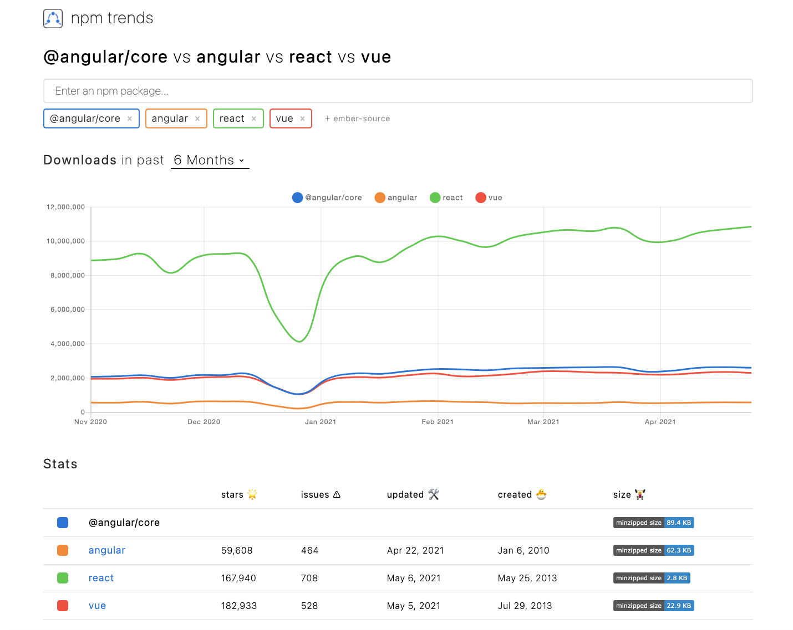

こんにちは。  
今回は、React の概念的な部分についてメモしておきます。  
React ってなんなの？と聞かれたときに答えられるようにしたいです。

#### なぜ React か

##### その１ 有名企業が使っていて人気がある

開発元である Facebook だけでなく、インスタグラム、Netflix や airbnb が採用しており、  
かつ開発者側にも人気の言語ということです。

##### その２ Virtual DOM がすごい

詳細な解説は[こちら](https://qiita.com/seira/items/6767e222890c9890ecb9)におまかせするとして、  
つまるところは、従来は画面に変更が入るたびに、実際に DOM 全体を作り直していたところを、  
変更の前後を Virtual DOM としてもっておくことで、差分だけ反映できるようになったということでしょうか。  
差分だけの反映なので、当然、高速化されます。

##### その３ 学習コストが低い

自分には比較対象がないので、どうかわかりませんが、JavaScript がわかっていていれば、  
JSX や Hooks はシンプルなので、たしかに参入しやすいかもしれません。

##### その４ ただし、フレームワークではない

React 公式にも「ユーザインターフェース構築のための JavaScript ライブラリ」とある通り、  
React は他の Angular などとは違い、フレームワークではありません。  
あくまで単なる View です。そのため、下記の機能は開発者が構築する必要があります。

- Forms
- Validation
- HTTP API Calls
- State management

個人的にはここがちょっと取っつきにくいと思うポイントかも知れません。  
Rails などであれば、ひとまず Rails を覚えれば全部出来ますが、  
React の場合、選択肢がたくさんあるため、どうしたらいいのか。。。と思ってしまいます。  
たとえば Validation なら Yup や zod、API なら、axios や fetch、State management なら Redux や MobX など。。。  
初心者としてはとりあえずの正解がほしいですね。

現在は、受講してきた Udemy の講座から、Validation ならそもそも TS で書けば解決、加えて、axios と Redux かなと思っていますが、エンジニアの友人は MobX 派だといっていて、よくわかりません。

##### その４ あくまでただの JS、あるいは TS

あくまでただの JS、あるいは TS です。

#### React のコンセプト

[公式](https://ja.reactjs.org/)をなんとなく読みつつ、噛み砕いて書いてみます。

##### その１ コンポーネント

従来は、ひとつのページに対して、HTML/CSS/JS の３つのファイルがあり、  
そこにすべてを記述していました。当然、見通しは悪いです。

React では、HTML/CSS/JS カプセル化したコンポーネントを組み合わせてひとつのページを作成するため、とても見通しがよく、かつ JavaScript そのもので記述ができるので、データの取り回しが簡単になります。

##### その２ Virtual DOM

先述したとおり、実際の DOM よりも高速に反応します。  
実体は、JS のオブジェクトツリーです。

##### その３ One way binding

[こちら](https://qiita.com/tamago3keran/items/590d99288dcccf388798)がとてもわかりやすく解説していました。  
要するに、双方向バインディングは View の更新とサーバなどのデータの更新が同期しているのに対し、  
単方向バインディングは、データの更新は別で処理を書く必要があるということですね。

メリットとしては、[React の流儀](https://ja.reactjs.org/docs/thinking-in-react.html#gatsby-focus-wrapper)にかかれているこちらや、デバッグのしやすさなどでしょうか。

> React の単方向データフロー（あるいは単方向バインディング）により、すべてがモジュール化された高速な状態で保たれます。

##### その４ JSX

React は JSX なしでも書けますが、実際は JSX なしで書くことはないと思います。  
それくらい、HTML をガリガリ書くのよりずっとらくちんです。

#### 最後に

Rails と React しか触ったことがないので、Vue や Angular についてはわかりませんが、  
いろいろな記事で書かれているとおり、React は高速で、堅牢で、開発体験もストレスが少ないと思います。  
概念的なところはこんなものでしょうか。

#### 参考

- [【React】仮想 DOM って何！？コンポーネントのレンダリングと描画について理解しよう！](https://qiita.com/seira/items/6767e222890c9890ecb9).

- [React 公式](https://ja.reactjs.org/).

- [React と Vue から単方向・双方向データバインディングの違いを知る](https://qiita.com/tamago3keran/items/590d99288dcccf388798).

- [React の流儀](https://ja.reactjs.org/docs/thinking-in-react.html#gatsby-focus-wrapper).
