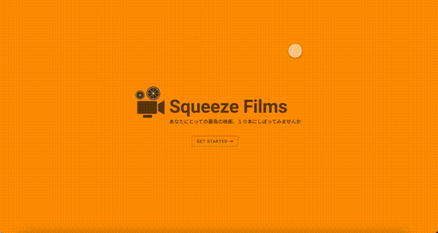

こんにちは。  
ポートフォリオ用の映画サイトを作り始めました。  
コンセプトはオールタイム・ベスト１０の映画を共有するってやつです。  
ひとまず、DB や URL の整理をして、XD でモックを作りました。

トップページは可愛く出来たんですが、  
基本的に Udemy で作ったアプリケーションを踏襲する感じなので、  
中身はちょっとダサめです。仕方ないですね。

これからコンポーネント作ってスタイリングして、  
徐々に実装していきますかって感じです。
