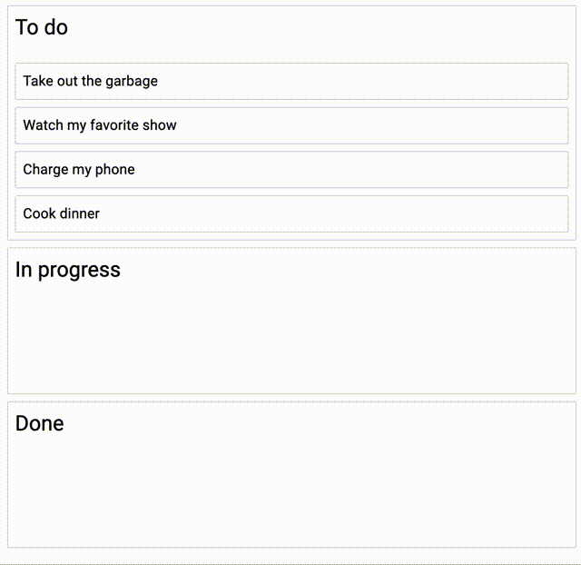
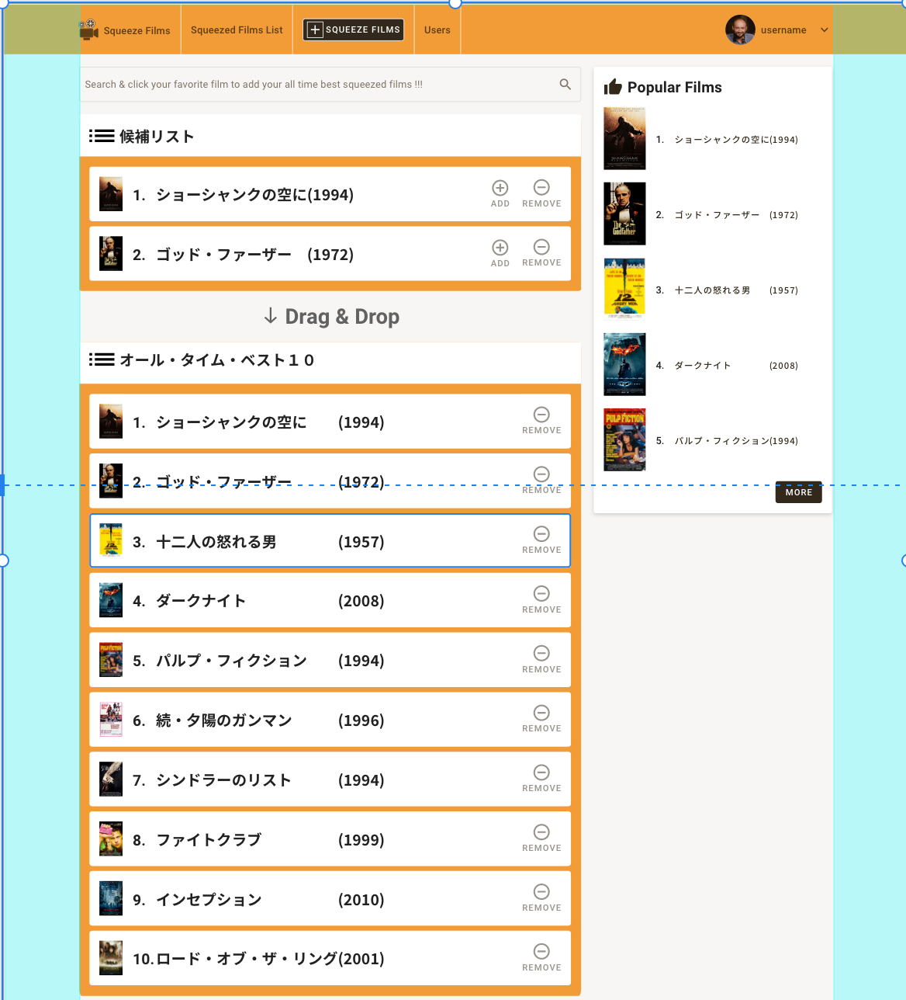

こんにちは。React/Drag＆Drop の実装 その２です。  
動画を一通り見ましたが、セクション１０以降はオプショナルな内容でした。  
そのため、セクション９までの内容で今回やりたいことは実現できました。

##### 完成図



#### onDragEnd をもう少し詳しく

##### result

まずは、data の更新部分である onDragEnd をもう少し詳しく見ていきましょう。
`result`という値を引数としていますが、これは下記のようなデータを持っています。

```js:title=onDragEnd
const onDragEnd = useCallback(
    (result) => {  /* 処理 */  },[])
```

```js:title=example-result.js
const result = {
  draggableId: 'task-1',
  type: 'TYPE',
  reason: 'DROP',
  source: {
    droppableId: 'column-1',
    index: 0,
  },
  destination: {
    droppableId: 'column-1',
    index: 1,
  },
};
```

今回使う項目は下記のとおりです。

- `draggableId` : 掴んでいるタスクの id
- `source` : 移動前のカラム
- `destination` : 移動後のカラム

##### 早期リターン

行き先のカラムが null の場合や、カラムもタスクの位置も同じ場合は早期リターンします。

```js:title=onDragEnd(抜粋)
const onDragEnd = useCallback(
    (result) => {
      const { destination, source, draggableId } = result;

      if (!destination) {
        return;
      }

      if (
        destination.droppableId === source.droppableId &&
        destination.index === source.index
      ) {
        return;
      }
```

##### 値の更新

下記では、data としていますが、state と読み替えるとわかりやすいと思います。  
ここでは state の更新をしています。  
詳しくは割愛しますが、よくある新しいオブジェクトを作って、setState する感じです。

```js:title=onDragEnd(抜粋)
      const column = data.columns[source.droppableId];

      const newTaskIds = Array.from(column.taskIds);
      newTaskIds.splice(source.index, 1);
      newTaskIds.splice(destination.index, 0, draggableId);

      const newColumn = {
        ...column,
        taskIds: newTaskIds,
      };
      const newData = {
        ...data,
        columns: {
          ...data.columns,
          [newColumn.id]: newColumn,
        },
      };
      setData(newData);
```

##### 全体

全体はこうなります。

```js:title=onDragEnd(全体)
const onDragEnd = useCallback(
    (result) => {
      const { destination, source, draggableId } = result;

      if (!destination) {
        return;
      }

      if (
        destination.droppableId === source.droppableId &&
        destination.index === source.index
      ) {
        return;
      }

      const column = data.columns[source.droppableId];

      const newTaskIds = Array.from(start.taskIds);
      newTaskIds.splice(source.index, 1);
      newTaskIds.splice(destination.index, 0, draggableId);

      const newColumn = {
        ...column,
        taskIds: newTaskIds,
      };
      const newData = {
        ...data,
        columns: {
          ...data.columns,
          [newColumn.id]: newColumn,
        },
      };
      setData(newData);
    },
    [data]
  );
```

#### ３カラムにしてみる

##### カラムを増やす

完成図と同じにするために、カラム数を増やします。
単純に data の中身のカラムを増やしてあげます。

```js:title=initial-data.js(抜粋)
columns: {
    'column-1': {
      id: 'column-1',
      title: 'To do',
      taskIds: ['task-1', 'task-2', 'task-3', 'task-4'],
    },
    'column-2': {
      id: 'column-2',
      title: 'In progress',
      taskIds: [],
    },
    'column-3': {
      id: 'column-3',
      title: 'Done',
      taskIds: [],
    },
  },
  columnOrder: ['column-1', 'column-2', 'column-3'],
```

#### state 更新の変更

先程の state 更新部分は、シングルカラムの場合だったので、少し変更が必要です。  
下記のようになります。

```js:title=onDragEnd(追記版)
const onDragEnd = useCallback(
    (result) => {
      const { destination, source, draggableId } = result;

      if (!destination) {
        return;
      }

      if (
        destination.droppableId === source.droppableId &&
        destination.index === source.index
      ) {
        return;
      }

      const start = data.columns[source.droppableId];
      const finish = data.columns[destination.droppableId];

      if (start === finish) {
        const newTaskIds = Array.from(start.taskIds);
        newTaskIds.splice(source.index, 1);
        newTaskIds.splice(destination.index, 0, draggableId);

        const newColumn = {
          ...start,
          taskIds: newTaskIds,
        };

        const newData = {
          ...data,
          columns: {
            ...data.columns,
            [newColumn.id]: newColumn,
          },
        };

        setData(newData);
        return;
      }

      const startTaskIds = Array.from(start.taskIds);
      startTaskIds.splice(source.index, 1);
      const newStart = {
        ...start,
        taskIds: startTaskIds,
      };

      const finishTaskIds = Array.from(finish.taskIds);
      finishTaskIds.splice(destination.index, 0, draggableId);
      const newFinish = {
        ...finish,
        taskIds: finishTaskIds,
      };

      const newData = {
        ...data,
        columns: {
          ...data.columns,
          [newStart.id]: newStart,
          [newFinish.id]: newFinish,
        },
      };
      setData(newData);
    },
    [data]
  );
```

`start`と`finish`という値を設定し、移動元と移動先について扱っています。  
`start`と`finish`が同じ場合は、シングルカラムの場合と変わりません。  
異なる場合は、taskIds をそれぞれ作ってあげている部分が追加になります。

#### 最後に

react-beautiful-dnd の使い方は以上になります。  
シンプルですが、値の更新部分は自前で書かないといけないので、ちょっと面倒ですね。  
映画サイトのなかで下のようなレイアウトのフォームを作る予定なので、  
ほぼまんま使えそうです。  
次は formik の復習です。



#### 参考

- [Beautiful and Accessible Drag and Drop with react-beautiful-dnd](https://egghead.io/courses/beautiful-and-accessible-drag-and-drop-with-react-beautiful-dnd).
