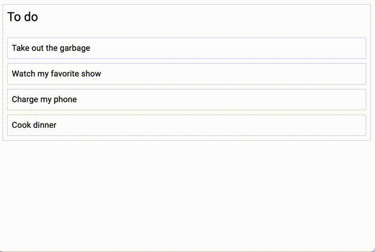

こんにちは。今日は Drag＆Drop の実装についてです。  
主に、react-beautiful-dnd というライブラリの使い方を見てきます。

#### react-beautiful-dnd

react-dnd というライブラリのほうが多機能のようですが、今回やりたいことは react-beautiful-dnd で可能だと思うので、こちらでやっていきます。

##### API

画像で見ると一目瞭然。


- `<DragDropContext />` - 全体をラップするコンポーネント
- `<Droppable />` - 下位の`<Draggable />`をラップするコンポーネント。カラム
- `<Draggable />` - ドラッグできるコンポーネント

##### 実装例

[Get Started](https://egghead.io/courses/beautiful-and-accessible-drag-and-drop-with-react-beautiful-dnd)の動画を第６回までみて、下記のような状態になりました。



#### react-beautiful-dnd ✕ function component ✕ Material UI

上記の動画がクラスコンポーネントかつ styled-components だったので、関数コンポーネントで書きつつ、Material UI にしています。結構実装することがあります。

##### `<DragDropContext />`

`data`という値に、下記の`initialData`を入れています。  
ここには、タスクやカラムの情報が入っています。  
`App.js`内では、この`data`を`onDragEnd`というコールバック関数を用いて更新する処理を行います。  
あとは、`map`して`data`の中身を下位のコンポーネントに渡しているだけですね。

```js:title=initial-data.js
const initialData = {
  tasks: {
    'task-1': { id: 'task-1', content: 'Take out the garbage' },
    'task-2': { id: 'task-2', content: 'Watch my favorite show' },
    'task-3': { id: 'task-3', content: 'Charge my phone' },
    'task-4': { id: 'task-4', content: 'Cook dinner' },
  },
  columns: {
    'column-1': {
      id: 'column-1',
      title: 'To do',
      taskIds: ['task-1', 'task-2', 'task-3', 'task-4'],
    },
  },
  columnOrder: ['column-1'],
};

export default initialData;

```

```js{7,9,41,47}:title=App.js
import initialData from './initial-data';
import { useCallback, useState } from 'react';
import Column from './Column';
import { DragDropContext } from 'react-beautiful-dnd';

function App() {
  const [data, setData] = useState(initialData);

  const onDragEnd = useCallback(
    (result) => {
      const { destination, source, draggableId } = result;

      if (!destination) {
        return;
      }

      if (
        destination.droppableId === source.droppableId &&
        destination.index === source.index
      ) {
        return;
      }

      const column = data.columns[source.droppableId];
      const newTaskIds = Array.from(column.taskIds);
      newTaskIds.splice(source.index, 1);
      newTaskIds.splice(destination.index, 0, draggableId);

      const newColumn = {
        ...column,
        taskIds: newTaskIds,
      };

      const newData = {
        ...data,
        columns: {
          ...data.columns,
          [newColumn.id]: newColumn,
        },
      };
      setData(newData);
    },
    [data]
  );

  return (
    <DragDropContext onDragEnd={onDragEnd}>
      {data.columnOrder.map((columnId) => {
        const column = data.columns[columnId];
        const tasks = column.taskIds.map((taskId) => data.tasks[taskId]);

        return <Column key={column.id} column={column} tasks={tasks} />;
      })}
    </DragDropContext>
  );
}

export default App;
```

##### `<Droppable />`

タスクリストのカラムに相当する部分です。今回はまだカラムはひとつです。
`Droppable`の子には次のように関数を入れないといけないです。

```js
<Droppable droppableId="droppable-1">
  {(provided, snapshot) => ({
    /*...*/
  })}
</Droppable>
```

- `provided` : 必須です
- `snapshot` : スタイルを変更するさいなどに使います。

実際に実装すると下記のようになります。  
`spanshot.isDraggingOver`を利用して、ドラッグしている最中はカラムの背景色を変更するようにしています。

```js{27,28}:title=Column.js
import { makeStyles, Typography } from '@material-ui/core';
import Task from './Task';
import { Droppable } from 'react-beautiful-dnd';

const useStyles = makeStyles((theme) => ({
  container: {
    margin: theme.spacing(1),
    border: '1px solid lightgrey',
    borderRadius: '2px',
  },
  title: {
    padding: theme.spacing(1),
  },
  taskList: {
    padding: '8px',
  },
}));

export default function Column({ column, tasks }) {
  const classes = useStyles();

  return (
    <div className={classes.container}>
      <Typography variant='h5' className={classes.title}>
        {column.title}
      </Typography>
      <Droppable droppableId={column.id}>
        {(provided, snapshot) => {
          const style = {
            backgroundColor: snapshot.isDraggingOver ? 'skyblue' : 'white',
            ...provided.droppableProps.style,
          };
          return (
            <Typography
              component='div'
              className={classes.taskList}
              innerRef={provided.innerRef}
              {...provided.droppableProps}
              style={style}
            >
              {tasks.map((task, index) => (
                <Task key={task.id} task={task} index={index} />
              ))}
              {provided.placeholder}
            </Typography>
          );
        }}
      </Droppable>
    </div>
  );
}
```

##### `<Draggable>`

`Droppable`と書き方が似ています。ハイライト部分は必須です。

```js{27,28,29}:title=Task.js
import { makeStyles, Typography } from '@material-ui/core';
import { Draggable } from 'react-beautiful-dnd';

const useStyles = makeStyles((theme) => ({
  task: {
    border: '1px solid lightgrey',
    borderRadius: '2px',
    padding: theme.spacing(1),
    marginTop: theme.spacing(1),
    backgroundColor: 'white',
  },
}));

export default function Task({ task, index }) {
  const classes = useStyles();

  return (
    <Draggable draggableId={task.id} index={index}>
      {(provided, snapshot) => {
        const style = {
          backgroundColor: snapshot.isDragging ? 'lightgreen' : 'white',
          ...provided.draggableProps.style,
        };
        return (
          <Typography
            className={classes.task}
            innerRef={provided.innerRef}
            {...provided.draggableProps}
            {...provided.dragHandleProps}
            style={style}
          >
            {task.content}
          </Typography>
        );
      }}
    </Draggable>
  );
}
```

#### 最後に

詳細については割愛しましたが、これで使い方がだいたいわかりました。  
Material UI でやるなら、Typography ではなく List コンポーネントで実装したほうがよさそうですね（[参考](https://codesandbox.io/s/material-ui-list-with-react-beautiful-dnd-p5phw?file=/index.js)）。  
それでは、続きの動画を見ていきたいと思います。

#### 参考

- [Material-UI で並べ替え可能なリストを作る](https://qiita.com/foooomio/items/1648e3a78ed2e40003f7).
- [react-beautiful-dnd](https://github.com/atlassian/react-beautiful-dnd).
- [Beautiful and Accessible Drag and Drop with react-beautiful-dnd](https://egghead.io/courses/beautiful-and-accessible-drag-and-drop-with-react-beautiful-dnd).
- [material-ui-list-with-react-beautiful-dnd](https://codesandbox.io/s/material-ui-list-with-react-beautiful-dnd-p5phw?file=/index.js).
