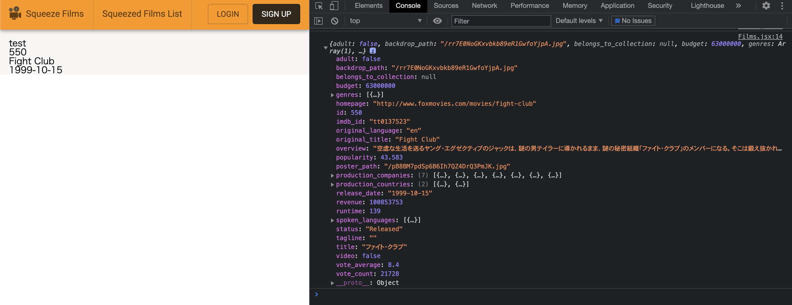

こんにちは。  
今回は TMDB API 入門ということで、いよいよ映画サイトらしくなってきました。  
とはいえ、API で使うのは機能のほんの一部分の予定です。  
youtube や技術記事などたくさん情報がありそうなので、困ることはないかと思います。

#### TMDB

TMDB とは、The Movie Database という無料の WEB API です。  
映画やテレビの情報をかなり詳細に提供してくれているみたいです。

##### 導入

導入に関しては、[こちら](https://weblion303.net/1262)の素晴らしい記事さま。
無事導入できました。

##### お試し fetch

お試しで fetch してみます。  
apikey は dotenv を使って`REACT_APP_TMDB_API_KEY`としています。

```js
import React, { useEffect, useState } from "react"

export default function Films() {
  const [fetchData, setFetchData] = useState()

  useEffect(() => {
    fetch(
      `https://api.themoviedb.org/3/movie/550?api_key=${process.env.REACT_APP_TMDB_API_KEY}&language=ja-JP`
    )
      .then(response => response.json())
      .then(json => setFetchData(json))
  }, [])

  console.log(fetchData)

  return (
    <>
      <div>test</div>
      {fetchData && (
        <>
          <div>{fetchData.id}</div>
          <div>{fetchData.original_title}</div>
          <div>{fetchData.release_date}</div>
        </>
      )}
    </>
  )
}
```



ファイトクラブ！！！
リクエストの URL の末尾に`&language=ja-JP`をつけているので、ちゃんと日本語の情報も取れています。

##### 人気映画の一覧を作る

#### 参考

- [無料で映画情報を取得する API「TMDb」の使い方](https://weblion303.net/1262).
- [1.TMDB api を使ったアプリケーション紹介](https://qiita.com/nomu-008/items/ed0eaf1c75e6d84400a7).
- [TMDB](https://www.themoviedb.org/).
