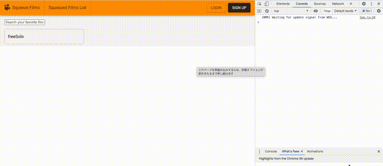

こんにちは。  
今回は TMDB の応用編ということで、React Autosuggest を使ったリッチな検索フォームを作成していきたいと思います。元ネタは[こちら](https://qiita.com/nomu-008/items/b22b0b1d64aba41d96d0)の記事様です。

モックを作っている段階でイメージしていたものとかなり近いのでラッキーです。

また、Material UI にどうやって組み込むんだろうな〜と思って調べたら、Material UI には、Autocomplete コンポーネントがあることに気がついて、そちらで実装もしてみました。

#### React Autosuggest

まずは、React Autosuggest の使い方についてです。  
公式の [Basic Usage](https://github.com/moroshko/react-autosuggest#basic-usage) を読んでみましょう。

##### Autosuggest

先に最終的なコンポーネントについて確認します。
ここで、props としてわたしているそれぞれの値についてです。
この他に、`onSuggestionSelected`というクリックイベントの値もあります。

```js:title=Autosuggest
return (
  <Autosuggest
    suggestions={suggestions}   // suggestionsの配列、値を更新していく
    onSuggestionsFetchRequested={this.onSuggestionsFetchRequested}   // suggestionsの値を更新する
    onSuggestionsClearRequested={this.onSuggestionsClearRequested}   // suggestionsの値をクリアする
    getSuggestionValue={getSuggestionValue}   // suggestされた値をクリックしたときに、その値を返す
    renderSuggestion={renderSuggestion}   // suggestionのレイアウト
    inputProps={inputProps}   // フォームのインプット
  />
);
```

定型文っぽいので、すべての中身は見ませんが、  
今回手を加える必要がありそうなのは、`onSuggestionsFetchRequested`で呼び出されている`getSuggestions`でしょうか。

##### getSuggestions

サンプルでは、`languages`という配列を用意して、インプットと配列の中身を突合しています。  
そして、前方一致したものに関して返却し、suggestions の配列に格納しています。

API を使う場合は、インプットを query として、検索結果を持ってくれば良さそうです。

```js:title=getSuggestions
const languages = [
  {
    name: 'C',
    year: 1972
  },
  {
    name: 'Elm',
    year: 2012
  },
  ...
];

const getSuggestions = value => {
  const inputValue = value.trim().toLowerCase();
  const inputLength = inputValue.length;

  return inputLength === 0 ? [] : languages.filter(lang =>        // ここで、インプットと突合している
    lang.name.toLowerCase().slice(0, inputLength) === inputValue
  );
};

// 中略

onSuggestionsFetchRequested = ({ value }) => {
    this.setState({
      suggestions: getSuggestions(value)
    });
  };
```

#### TMDB Search / React Autosuggest

それでは、実際に実装していきます。全体はこんな感じになりました。
メイン部分 だけ詳しく見ていきます。

```js
import React, { useState } from "react"
import axios from "axios"
import Autosuggest from "react-autosuggest"
import FilmSuggestionCard from "./FilmSuggestionCard"
import FlimAutoCompleteForm from "./FilmAutoCompleteForm"

async function getSuggestions(value) {
  const inputValue = value.trim().toLowerCase()
  const inputLength = inputValue.length

  if (inputLength === 0) {
    return []
  } else {
    const suggestionValue = await axios
      .get(
        `https://api.themoviedb.org/3/search/movie?api_key=${process.env.REACT_APP_TMDB_API_KEY}&query=${inputValue}&language=ja-JP`
      )
      .then(res => {
        return res.data.results
      })
      .then(results => {
        const suggestionFilms = results.map(film => {
          const temp = {
            id: film.id,
            title: film.title,
            img:
              film.poster_path &&
              `https://image.tmdb.org/t/p/w200${film.poster_path}`,
            year: film.release_date && film.release_date.slice(0, 4),
          }
          return temp
        })
        return suggestionFilms
      })
    return suggestionValue
  }
}

function getSuggestionValue(suggestion) {
  return suggestion.title
}
function renderSuggestion(suggestion) {
  return (
    <FilmSuggestionCard
      title={suggestion.title}
      year={suggestion.year}
      img={suggestion.img}
    />
  )
}

export default function FilmSuggestionForm() {
  const [value, setValue] = useState("")
  const [suggestions, setSuggestions] = useState([])

  const inputProps = {
    placeholder: "Search your favorite film !",
    value,
    onChange: onChange,
  }

  function onChange(event, { newValue }) {
    setValue(newValue)
  }

  function onSuggestionsFetchRequested({ value }) {
    getSuggestions(value).then(res => setSuggestions(res))
  }

  function onSuggestionsClearRequested() {
    setSuggestions([])
  }

  function onSuggestionSelected(event, { suggestion, method }) {
    if (method === "click" || method === "enter") {
      console.log(suggestion)
      setValue("")
    }
  }

  return (
    <>
      <Autosuggest
        suggestions={suggestions}
        onSuggestionsFetchRequested={onSuggestionsFetchRequested}
        onSuggestionsClearRequested={onSuggestionsClearRequested}
        onSuggestionSelected={onSuggestionSelected}
        getSuggestionValue={getSuggestionValue}
        renderSuggestion={renderSuggestion}
        inputProps={inputProps}
      />
      <FlimAutoCompleteForm />
    </>
  )
}
```

##### getSuggestions

inputLength が 0 以外の場合に、axios で API にリクエストを送っています。  
返却された値を加工して、suggestionValue として返しています。  
img と year は取得できないことがあるので、取得できた場合にのみ実行されるようにしています。

```js:title=getSuggestions
async function getSuggestions(value) {
  const inputValue = value.trim().toLowerCase()
  const inputLength = inputValue.length

  if (inputLength === 0) {
    return []
  } else {
    const suggestionValue = await axios
      .get(
        `https://api.themoviedb.org/3/search/movie?api_key=${process.env.REACT_APP_TMDB_API_KEY}&query=${inputValue}&language=ja-JP`
      )
      .then(res => {
        return res.data.results
      })
      .then(results => {
        const suggestionFilms = results.map(film => {
          const temp = {
            id: film.id,
            title: film.title,
            img:
              film.poster_path &&
              `https://image.tmdb.org/t/p/w200${film.poster_path}`,
            year: film.release_date && film.release_date.slice(0, 4),
          }
          return temp
        })
        return suggestionFilms
      })
    return suggestionValue
  }
}
```

##### onSuggestionsFetchRequested

getSuggestions()は返り値が Promise オブジェクトであるため、then で値を受け取って、setSuggestin()してあげます。こうすることで、useState により suggestions の値が更新されます。

```js
function onSuggestionsFetchRequested({ value }) {
  getSuggestions(value).then(res => setSuggestions(res))
}
```

##### onSuggestionSelected

suggestion がクリックされたら実行されます。  
いまは、コンソール出力と、value のクリアのみにしていますが、  
今後はここに実装していきます。

```js
function onSuggestionSelected(event, { suggestion, method }) {
  if (method === "click" || method === "enter") {
    console.log(suggestion)
    setValue("")
  }
}
```

以上で終わりです。理解できれば意外と簡単でしたね！

#### Material UI Autocomplete

Material UI には core に未実装の [lab](https://material-ui.com/components/about-the-lab/#about-the-lab) というくくりのものがあります。  
今回実装する Autocomplete のほかにも、Data Grid や Pagenation など、気になる項目がいくつもあります。

細かくカスタマイズする場合には useAutocomplete という Hook を利用するようですが、  
今回はデフォルトのコンポーネントで実装していきます。それでは上から見ていきます。

##### import 部分

autocomplete コンポーネントのおかげで import 文がとてもスッキリ

```js
import React, { useState } from "react"
import TextField from "@material-ui/core/TextField"
import Autocomplete from "@material-ui/lab/Autocomplete"
import axios from "axios"
```

##### getSuggestions

autocomplete では、options というプロパティに候補を渡すと、表示されます。  
Autosuggest のなごりで getSuggestions 関数としています。  
実装内容はコピペでいけました。

```js
async function getSuggestions(value) {
  const inputLength = value.length

  if (inputLength === 0) {
    return []
  } else {
    const suggestionValue = await axios
      .get(
        `https://api.themoviedb.org/3/search/movie?api_key=${process.env.REACT_APP_TMDB_API_KEY}&query=${value}&language=ja-JP`
      )
      .then(res => {
        return res.data.results
      })
      .then(results => {
        const suggestionFilms = results.map(film => {
          const temp = {
            id: film.id,
            title: film.title,
            img:
              film.poster_path &&
              `https://image.tmdb.org/t/p/w200${film.poster_path}`,
            year: film.release_date && film.release_date.slice(0, 4),
          }
          return temp
        })
        return suggestionFilms
      })
    return suggestionValue
  }
}
```

##### onInputChangeHandler と onSuggestionsFetchRequested

フォームで入力があるたびに、onInputChangeHandler が実行されます。  
event というのは、`change`や`click`など、です。  
value に値が格納されています。

また、suggestion をクリックした際に、フォームの中をクリアしたいので、  
`inputValue`という値を useState で定義して、紐付けています。

```js
export default function FlimAutoCompleteForm() {
  const [inputValue, setInputValue] = useState("")
  const [suggestions, setSuggestions] = useState([])

  function onInputChangeHandler(event, value) {
    if (!event) {
      return
    }

    if (event && event.type === "change") {
      setInputValue(value)
      onSuggestionsFetchRequested(value)
    } else if (event && event.type === "click") {
      console.log(event)
      console.log(value)
      setInputValue("")
    }
  }

  function onSuggestionsFetchRequested(value) {
    getSuggestions(value).then(res => setSuggestions(res))
  }

```

##### Autocomplete

Autocomplete コンポーネントです。それぞれ、プロパティはこんな感じです。詳しくは[ドキュメント](https://material-ui.com/api/autocomplete/)参照のこと。

- inputValue : インプットと useSate した値を紐付けます
- freeSolo : true にすると、ユーザー入力は提供されたオプションにバインドされません
- blurOnSelect : セレクトした際に、フォームからフォーカスが解除になります
- onInputChange : 入力に変更があると実行されます
- options : suggestions の配列をわたします
- renderInput : フォームの UI です

```js

return (
  <div style={{ width: 300 }}>
    <Autocomplete
      inputValue={inputValue}
      id="free-solo-demo"
      freeSolo
      blurOnSelect
      onInputChange={(event, value) => onInputChangeHandler(event, value)}
      options={suggestions.map(option => option.title)}
      renderInput={params => (
        <TextField
          {...params}
          label="freeSolo"
          margin="normal"
          variant="outlined"
        />
      )}
    />
  </div>
)
}
```

#### 最後に

以上で、React Autosuggest と Material UI Autocomplete については終わりです。  
Autocomplete を先に知っていれば、ふたつ実装することはなかったのですが、React Autosuggest の中身がわかっていたので、英語のドキュメントを読んで理解できたみたいなところはあります。結果オーライ。

完成品は下記です！！！  
Autosuggest のほうがリッチですが、気が向いたら Autocomplete でも同じようなのを実装していきます。



#### 参考

- [4.TMDB 検索 auto-suggestion](https://qiita.com/nomu-008/items/b22b0b1d64aba41d96d0).

- [React Autosuggest](https://github.com/moroshko/react-autosuggest#basic-usage).

- [About the lab](https://material-ui.com/components/about-the-lab/#about-the-lab).
