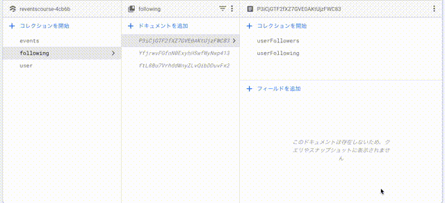

こんにちは。今回は Firebase の概要についてです。  
映画アプリの基本機能は出揃ったので、あとはユーザ周りの機能になります。  
認証は Firebase の機能を使ったり、ユーザがアップロードする画像やチャットデータなんかも Firestore の機能を使っていく予定なので、ここいらで入門しておこうと思います。

#### Firebase とは

Firebase はモバイルや Web アプリケーション開発に活用できる mBaaS の一つであり、バックエンド環境を提供するサービスです。

##### mBaaS

mBaaS とは「mobile backend as a Service」の略語です。バックエンド側のインフラを提供しているため、開発コストを抑えることができます。  
いわゆる三大クラウドと呼ばれる、AWS、GCP、Azure とはまた違った立ち位置ですね。  
mBaaS には他に、AWS Mobile Hub や Azure App Service 何ていうのもあるみたいです。

##### Firebase の特徴

Firebase の最大の特徴はリアルタイム同期と呼ばれる仕組みです。  
サーバ上の DB に対して、データを更新したり取得したりするわけではなく、アプリケーションがデータベースのローカルコピーを保持し、サーバと接続したタイミングでデータの同期が行われるという仕組みのようです。

#### Firebase の機能

ここでは使用する予定のいくつかを抜粋して Firebase の機能を見ていきます。

##### Firebase Authentication

Firebase Authentication では、メール、パスワード、、Google アカウント、Facebook アカウント、Twitter アカウントなどを使用したユーザ認証機能を提供しています。  
ポチポチ設定を押すだけで認証機能が実装できるのでとってもらくちんです。

##### Firebase Realtime Database

Firebase Realtime Database は JSON として保存され、接続されるクラウドホスト型データベースです。データはリアルタイムで同期されます。

##### Firebase Cloud Firestore

柔軟でスケーラブルな NoSQL クラウド データベースであり、Realtime Database に対して、もうちょっと 複雑な操作が可能になります。  
コレクション＞ドキュメント＞フィールドという階層構造になっており、感覚としては OS のファイルシステムに近いですね。

##### Cloud Storage for Firebase

Cloud Storage はユーザがアップロードしたファイルの保管を行ったり、アプリから扱うことができるようにする機能です。

##### Firebase Hosting

Firebase Hosting は、静的コンテンツと動的コンテンツ、マイクロサービスなどをデプロイできる環境です。  
React であれば、build した public ファイルをアップロードすれば、動いてしまうというとても楽ちんなやつです。

#### 最後に

Firebase の概要についてだいたいわかったと思います。  
とにかくバックエンド周りのめんどくさい処理一切を引き受けてくれるので、フロントエンド側としては、とても心強い味方です。  
とはいえ、バックエンド側も一通り理解したいとは思っているので、早く Udemy の Node.js 入門や React/GraphQL 講座なんかもやりたいところですが、なかなかそこまで手が回らない。。。

#### 参考

- [Firebase とは？Google 社の強みを活かしたメリットや機能をご紹介](https://udemy.benesse.co.jp/development/system/what-is-firabase.html).

- [Firebase](https://firebase.google.com/docs?hl=ja).
