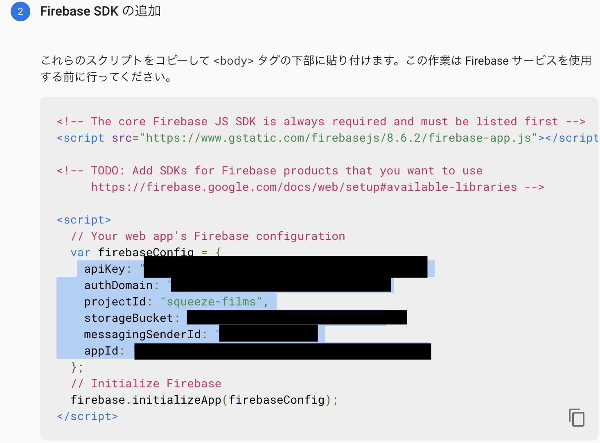

こんにちは。今回は firebase をアプリケーションで利用するための準備をしていきます。  
詳細な手順は割愛します。

#### プロジェクト作成

プロジェクトの準備は、[コンソール](https://console.firebase.google.com/)画面から、適当にポチポチすればできるので割愛します。

#### ウェブアプリに Firebase を追加

コンソール画面を開いて、ウェブアプリに追加すると、下のような画面が出てきます。  
ここに api key などがあるので、これを利用していきます。  
squeeze-films というのがプロジェクト名です！



#### npm install と設定ファイル

npm install してあげて、下記のように設定ファイルを作成します。
これで、firebase インスタンスを呼び出せるようになりました。

```bash
npm install firebase
```

```js:title=firebase.js
import firebase from 'firebase/app';
import 'firebase/firestore';
import 'firebase/database';
import 'firebase/auth';
import 'firebase/storage';

const firebaseConfig = {
  apiKey: /* apiKey */,
  authDomain: /* authDomain */,
  projectId:  /* projectId */,
  storageBucket: /* storageBucket */,
  messagingSenderId: /* messagingSenderId */,
  appId: /* appId */,
};

firebase.initializeApp(firebaseConfig);
firebase.firestore();

export default firebase;
```

#### Firestore の雛形を作成する

これは Firebase のコンソール画面でする操作なのですが、手順は割愛します。
[ドキュメント](https://firebase.google.com/docs/firestore/quickstart)参照のこと。
それでは、Firestore への操作について確認していきます。  
db という変数をインスタンスとして、操作していきます。

```js
import firebase from "../config/firebase"

const db = firebase.firestore()
```

#### Firestore のデータの追加と管理

ドキュメントの内容と同じですが、詳細な説明は省いてメモっておきます。

##### ドキュメントの設定

単一のドキュメントを作成または上書きするには、set() メソッドを使用します。

```js
db.collection("cities").doc("LA").set({
  name: "Los Angeles",
  state: "CA",
  country: "USA",
})
```

##### ドキュメントの追加

set はドキュメント ID が必要ですが、Cloud Firestore に ID を自動的に生成させる場合は、add() メソッドを使用します。あるいは、add()メソッドと同等な .doc().set(...)を使用する事もできます。

```js
db.collection("cities").add({
  name: "Tokyo",
  country: "Japan",
})

// Add a new document with a generated id.
var newCityRef = db.collection("cities").doc()
// later...
newCityRef.set(data)
```

##### ドキュメントの更新

update() メソッドを使用します。タイムスタンプなんかも設定できるみたいです。

```js
var washingtonRef = db.collection("cities").doc("DC")

// Set the "capital" field of the city 'DC'
return washingtonRef.update({
  capital: true,
})
```

##### ネストされたドキュメントの更新

ここは微妙に間違いそうなポイントです。  
ドキュメント内にオブジェクトを保持しており、そのオブジェクトの中のひとつの項目を更新する場合、ドット表記をすることで実現できます。  
もしドット表記を使わない場合は、オブジェクト全体が上書きされてしまいます。

```js{12}
// Create an initial document to update.
var frankDocRef = db.collection("users").doc("frank");
frankDocRef.set({
    name: "Frank",
    favorites: { food: "Pizza", color: "Blue", subject: "recess" },
    age: 12
});

// To update age and favorite color:
db.collection("users").doc("frank").update({
    "age": 13,
    "favorites.color": "Red"  //favoritesのcolorの値だけ更新している
})
```

##### 配列内の要素を更新する

配列の操作では、arrayUnion() と arrayRemove() を使用して要素を追加および削除できます。

- arrayUnion() : 要素を配列に追加しますが、追加されるのはまだ存在しない要素のみです
- arrayRemove() : 指定した各要素のすべてのインスタンスを削除します

##### 数値を増やす

increment()などの補助メソッドもあります。

##### ドキュメントを削除する

ドキュメントを削除するには、delete() メソッドを使用します。

```js
db.collection("cities").doc("DC").delete()
```

##### フィールドを削除する

ドキュメントを更新するときに FieldValue.delete() メソッドを使用します。

```js{5}
var cityRef = db.collection("cities").doc("BJ")

// Remove the 'capital' field from the document
var removeCapital = cityRef.update({
  capital: firebase.firestore.FieldValue.delete(),
})
```

トランザクションやバッチ処理は割愛します。

#### Firestore のデータの読み取り

Cloud Firestore に格納されているデータを取得するには 2 つの方法があります。

- メソッドを呼び出してデータを取得する : get()
- データ変更イベントを受信するリスナーを設定する : onSnapshot()

##### ドキュメントを取得する

get()メソッドで取得できます。

```js
var docRef = db.collection("cities").doc("SF")

docRef
  .get()
  .then(doc => {
    if (doc.exists) console.log("Document data:", doc.data())
    // docが空の場合、existsでfalseが返る
    else console.log("No such document!")
  })
  .catch(error => {
    console.log("Error getting document:", error)
  })
```

##### コレクションから複数のドキュメントを取得する

get()メソッドでコレクションから複数ドキュメントを取得できます。  
また、where()メソッドでクエリすることもできます。

```js
db.collection("cities")
  .where("capital", "==", true)
  .get()
  .then(querySnapshot => {
    querySnapshot.forEach(doc => {
      // doc.data() is never undefined for query doc snapshots
      console.log(doc.id, " => ", doc.data())
    })
  })
  .catch(error => {
    console.log("Error getting documents: ", error)
  })
```

##### onSnapshot()

onSnapshot() メソッドを使用すると、最初の呼び出しでは、単一のドキュメントの現在のコンテンツですが、以降はコンテンツに変更があるたびにドキュメントのスナップショットが更新されます。

ローカルに書き込みがあると、スナップショットリスナーが起動します。  
また、書き込みのステータスは metadata.hasPendingWrites プロパティで保持されています。

```js
db.collection("cities")
  .doc("SF")
  .onSnapshot(doc => {
    console.log("Current data: ", doc.data())
  })
```

ちなみに、単純な関数ではなく、observer と呼ばれるコールバック関数を含むオブジェクトを渡すことができます。ドキュメントは[ここ](https://firebase.google.com/docs/reference/js/firebase.firestore.DocumentReference#onsnapshot)です。complete ってのは呼び出されることとはないので不要みたいです。

```js
onSnapshot
( observer :
  {
      complete ?: ( ) => void ;
      error ?: ( error :  FirestoreError ) => void ;
      next ?: ( snapshot :  DocumentSnapshot < T > ) => void
  })
:
( ) => void
```

##### コレクション内の複数のドキュメントのリッスン

ドキュメントの場合と同様に、get() ではなく onSnapshot() を使用して where()メソッドによりクエリの結果をリッスンできます。

```js
db.collection("cities")
  .where("state", "==", "CA")
  .onSnapshot(querySnapshot => {
    var cities = []
    querySnapshot.forEach(doc => {
      cities.push(doc.data().name)
    })
    console.log("Current cities in CA: ", cities.join(", "))
  })
```

##### リスナーのデタッチ

データをリッスンする必要がなくなったら、イベント コールバックが呼び出されないようにリスナーをデタッチしなければなりません。

```js
var unsubscribe = db.collection("cities").onSnapshot(() => {
  // Respond to data
  // ...
})

// Later ...

// Stop listening to changes
unsubscribe()
```

##### 単純なクエリ

単純なクエリの例です。

```js
citiesRef.where("state", "==", "CA")
citiesRef.where("population", "<", 100000)
citiesRef.where("name", ">=", "San Francisco")
```

##### in、not-in、array-contains-any

firestore で定義された演算子です。

```js
citiesRef.where("country", "in", ["USA", "Japan"])
citiesRef.where("country", "not-in", ["USA", "Japan"])
citiesRef.where("regions", "array-contains-any", ["west_coast", "east_coast"]) //重複は削除
```

##### 複合クエリ

複数の演算子をチェーンしてクエリ（論理 AND）を作成できます。  
ただし、等価演算子を不等演算子と組み合わせるには、`複合インデックス`を作成する必要があります。  
また、範囲（<、<=、>、>=）または不等値（!=）の比較は 1 つのフィールドに対してのみ実行できるなど、制約もあります。

```js
citiesRef.where("state", "==", "CA").where("population", "<", 1000000)

// 下記は実行不可
citiesRef.where("state", ">=", "CA").where("population", ">", 100000)
```

##### データの並べ替えと制限

orderBy()や limit()メソッドを活用できます。where()との組み合わせも可能です。

```js
citiesRef
  .where("population", ">", 100000)
  .orderBy("population", "desc")
  .limit(2)
```

#### 実装してみる

firestore から単純にデータを呼び出すものを実装してみます。  
shelfs というコレクションから onSnapshot でリッスンしています。  
リッスンに成功した場合は、snapshot を受け取り、next に定義されている関数を実行します。  
dataFromSnapshot は整形のための補助関数です。

```js
import firebase from "../config/firebase"

const db = firebase.firestore()

export function dataFromSnapshot(snapshot) {
  if (!snapshot.exists) return undefined
  const data = snapshot.data()

  for (const prop in data) {
    if (data.hasOwnProperty(prop)) {
      if (data[prop] instanceof firebase.firestore.Timestamp) {
        data[prop] = data[prop].toDate()
      }
    }
  }

  return {
    ...data,
    id: snapshot.id,
  }
}

export function getShelfsFromFirestore(observer) {
  return db.collection("shelfs").onSnapshot(observer)
}

// 実際に呼び出し useEffectしたほうがいい
const unsubscribe = getShelfsFromFirestore({
  next: snapshot =>
    console.log(
      snapshot.docs.map(docSnapshot => dataFromSnapshot(docSnapshot))
    ),
  error: error => console.log(error),
})

return unsubscribe
```

#### 最後に

以上で、firestore 入門は終わりです。  
Udemy の動画を復習していたのですが、onSnapshot が何をしているのかわからなすぎて、ドキュメントをちゃんと読んでみました。  
次回は、firestore と redux が絡み合ってややこしくなりそうです。

#### 参考

- [Firebase](https://console.firebase.google.com/).

- [Firestore](https://firebase.google.com/docs/firestore/quickstart).

- [onSnapshot](https://firebase.google.com/docs/reference/js/firebase.firestore.DocumentReference#onsnapshot).
