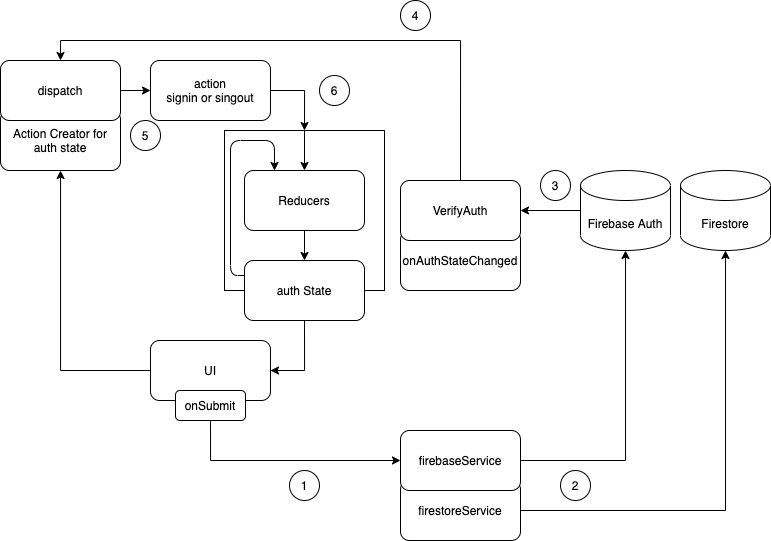

こんにちは。今回は Firebase Authentication での認証についてです。  
Firebase Authentication は他の Firebase サービスと緊密に統合されており、JWT(JSON Web Token)ベースで作られています。
メールとパスワードでの認証やソーシャルログイン機能など、様々な機能が提供されています。  
導入にあたっての事前準備は[ドキュメント](https://firebase.google.com/docs/auth/web/firebaseui)参照のこと。  
今回は概念的な説明のみです。

#### auth の概要

auth の全体像から確認していきます。  
これが複雑すぎて、最初何やってるのかわからなかったですね。  
言葉での説明は困難なので、draw.io で簡易フローを作成してみました。順番に見ていきましょう。

1. UI で signin や signup などのボタンで onSubmit（形式は Formik でチェック）
1. firebaseService で Firebase Auth に値を送る（場合によっては、firestore の値も更新）
1. Firebase で更新があると、onAuthStateChanged()が呼び出される
1. onAuthStateChanged()から帰ってきた`user`情報をもとに、dispatch
1. signin や signout など、dispatch された先で、action を作成
1. state の更新

##### 何がややこしいのか

通常の Redux / Redux Thunk の構成と比べると、ややこしさがわかると思います。  
下記は、TMDB から情報をとってくる場合のフローです。

通常、UI での変更などから、dipatch し、ActionCreator を呼び出します。  
外部とのやりとりが発生する場合は、Redux Thunk がその部分を担当しているので、  
受け取った値をもとに action を作成します。

そのうえで、state が更新され、図上にはないですが、  
useSelector を介して、UI に state の変更が渡ります。

しかし、auth の場合は、UI から直接 dispatch を呼び出すことはなく、  
Firebase の値を変更を介して、dispatch を呼び出しています。

再掲

Firebase の変更部分の監視は、onAuthStateChanged が請け負っているため、こういう仕組みになるのでしょうか。

#### 最後に

今回はコードは掲載しませんが、概念的にはこんな感じでした。  
コードを読み返しても絶対に理解できない自信があったので、図にして残しておきます。  
それにしても draw.io はパワポより全然図が描きやすくてよかった。  
そもそも mac だからパワポないですし。。。

認証機能もついて、ソーシャルログインもできるので、  
アプリもぼちぼちそれっぽくなってきました。

