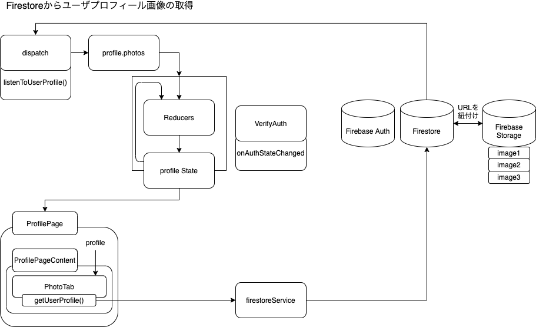
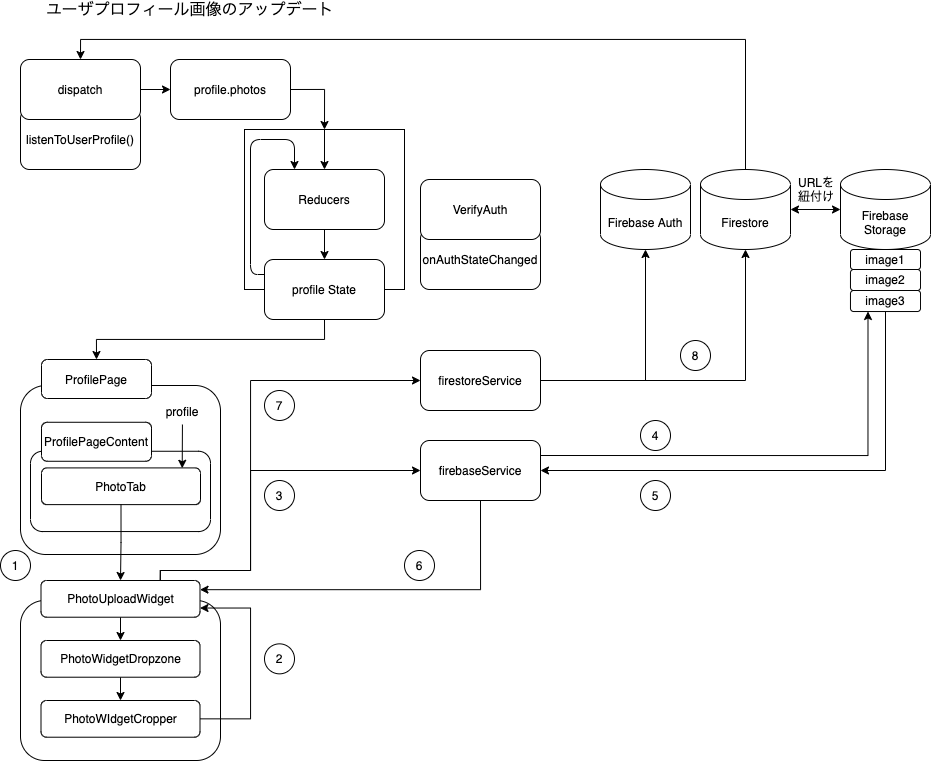
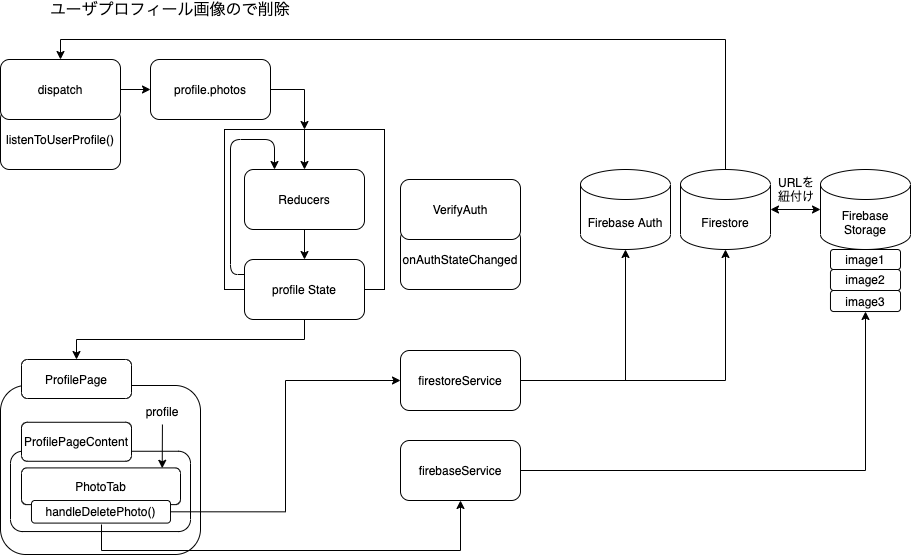

こんにちは。今回は、Firebase/Dropzone/Cropper を使ったユーザのプロフィール更新機能についてです。
必要な知識は Redux と Firebase くらいでしょうか。スタイリングなど細かいコードは省きます。

最後はこんな感じになります。


#### 全体の構造

まずは全体のディレクトリ構造について確認していきます。

```bash
./src
├── app
│   │   ├── photos
│   │   │   ├── PhotoUploadWidget.jsx   // PhotoUpload機能の本体
│   │   │   ├── PhotoWidgetCropper.jsx  // react-cropperの実装部分
│   │   │   └── PhotoWidgetDropzone.jsx // react-dropzoneの実装部分
│   │   └── utility.js  // ファイル名を作成するメソッドが定義
│   ├── firestore
│   │   ├── firebaseService.js  // firebase auth, storageとの接続
│   │   └── firestoreService.js // firestoreとの接続
│   ├── hooks
│   │   ├── useFirestoreCollection.js   //dbからcollectionを取得する
│   │   └── useFirestoreDoc.js    // dbからdocumentを取得する
├── feature
│   ├── profile
│   │   ├── profileAction.js    // profileのAction Creator
│   │   ├── profileConstents.js // profileの定義
│   │   ├── profileReducer.js   // profileのReducer
│   │   └── profilePage         // profilePageのフォルダ
│   │        ├── ProfilePage.jsx        // PhotoTabのふたつ上の階層のコンポーネント
│   │        ├── ProfilePageContent.jsx // PhotoTabのひとつ上の階層のコンポーネント
│   │        └── PhotosTab.jsx          // 今回のメイン
...
```

#### ユーザプロフィール画像の取得、更新、削除

ユーザプロフィール画像の取得、更新、削除について、フローをまじえて確認していきます。

##### ユーザプロフィール画像の取得

さて、まずはユーザプロフィール画像の取得についてです。  
前提として、ユーザプロフィールの画像は、Firebase Storage に格納されており、Firestore および Firebase Auth は、photoURL に、Storage のパスを保有しています。

今回は PhotoTab にてその値を利用するため、getUserProfile()という firestoreService 上に定義した関数を使って、値を取得し、ActionCretor の listenToUserProfile()で profile の state を更新します。



##### ユーザプロフィール画像の更新

つぎに、ユーザプロフィール画像の更新についてです。ここが一番カオスですね。  
とはいえ、関係するファイルが多いだけで、難しい処理をしているわけではありません。



1. PhotoUploadWidget 呼び出し。今回メインの部分です
1. PhotoWidgetDropzone で、ローカルからファイルをアップロードし、PhotoWidgetCropper で画像の範囲を切り取って加工します
1. firebaseService の uploadToFirebaseStorage()を呼び出し
1. Firebase Storage にアップロード
1. アップロードした情報（ファイルパス）を取得
1. ファイルパスを PhotoUploadWidget が取得
1. パスの情報をもとに、firestoreService の photo の情報を更新

よく考えると、firestoreService って命名なのに、firebase auth の値も更新しちゃってますね。まあ簡単な処理なので。

##### ユーザプロフィール画像の削除

最後にプロフィール画像の削除です。もはや dropzone と cropper は関係ないですが、一応整理のために。  
PhotoTab からそれぞれ firebaseService と firestoreService を呼び出して、db を更新しています。



以上で、DB の更新まわりの整理は終わりです。

#### Dropzone/Cropper

処理の流れさえわかってしまえば、ライブラリの使い方は大したことないので、公式のドキュメントを貼って終わりにします。

##### react-dropzone

[公式](https://react-dropzone.js.org/)のままにコンポーネント作れば何も問題なく動きました。

##### react-cropper

[こちら](https://github.com/react-cropper/react-cropper)も example 通りにコンポーネントを設定すれば終わりです。

#### 最後に

メインどころというより、firebase の処理を整理することで終わりました。逆に言うと、ライブラリは良く出来てるので、特につまるところなく実装できてありがたいです。  
このサイトはあと３日くらいで完成するかなー。

完成図


#### 参考

- [react-dropzone](https://react-dropzone.js.org/).
- [react-cropper](https://github.com/react-cropper/react-cropper).
