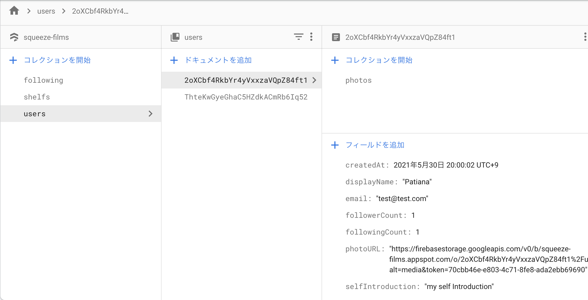
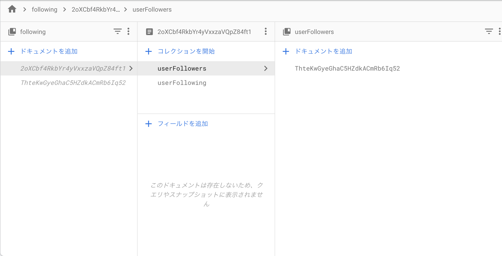
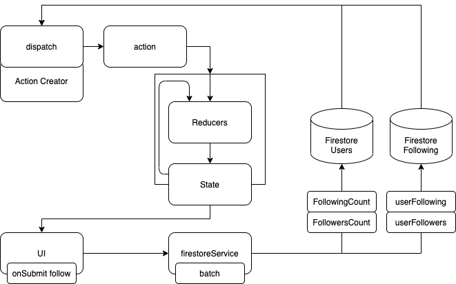

こんにちは。今回は Firebase におけるトランザクション処理とバッチ処理についてです。  
基礎的な用語の確認からしていきます。

#### トランザクション処理

トランザクション処理とは、一連の処理のかたまりのことであり、かつ即座に結果が反映されるものです。  
結果としては、DB の整合性を保つために、成功か失敗かでコミットしたりロールバックしたりします。銀行業務など、金融系のシステムなんかがイメージされそうです。

バッチ処理との違いは、「即座に」というところでしょうか。

#### バッチ処理

バッチ処理とは、一定期間ごとに処理をまとめて実行することであり、即座に結果反映は行わないものです。  
ログの収集やバックアップなど、日次や月次で行われるもののイメージですかね。

#### Firebase におけるトランザクションとバッチ

Firebase においてもほぼそのままです。

- トランザクション: トランザクションは、1 つ以上のドキュメントに対して読み取り / 書き込みを行う一連のオペレーションです。
- バッチ書き込み: バッチ書き込みは、1 つ以上のドキュメントに対して書き込みを行う一連のオペレーションです。

#### Firebase におけるバッチの例

今回は、バッチ処理の例を見ていきます。  
ユーザ同士がフォロー・フォロワーに関係にあるときに、Users と Following という２つの DB に情報をもっていると想定します。（こういう事例は、普通は中間テーブルを使って表現すると思いますが、それよりもローテクです）

DB の構成は下記です。

##### users

followingCount/followerCount という項目に更新をかけます



##### following

following/follower どちらにも、ユーザ情報を持っています



##### DB 整合性

今回の場合、users の中でも、フォロー側、フォローされた側の情報更新をし、かつ following でも同様に相互に更新をかけます。そのため、ひとかたまりの処理として考えるのが自然です。



##### 実装例

batch.set()と batch.update()を計４つ定義し、最後に batch.commit()しています。

```js:title=followUser
export async function followUser(profile) {
  const user = firebase.auth().currentUser;
  const batch = db.batch();
  try {
    batch.set(
      db
        .collection('following')
        .doc(user.uid)
        .collection('userFollowing')
        .doc(profile.id),
      {
        displayName: profile.displayName,
        photoURL: profile.photoURL,
        uid: profile.id,
      }
    );
    batch.set(
      db
        .collection('following')
        .doc(profile.id)
        .collection('userFollowers')
        .doc(user.uid),
      {
        displayName: user.displayName,
        photoURL: user.photoURL,
        uid: user.uid,
      }
    );
    batch.update(db.collection('users').doc(user.uid), {
      followingCount: firebase.firestore.FieldValue.increment(1),
    });
    batch.update(db.collection('users').doc(profile.id), {
      followerCount: firebase.firestore.FieldValue.increment(1),
    });
    return await batch.commit();
  } catch (error) {
    throw error;
  }
}
```

#### その他メモその１

全く関係ない処理ですが、JavaScript の書き方てきに気になったものをメモしときます。

##### オブジェクト → 配列への変換

こういうオブジェクトを

```js{1}
-Mawy1sUwB9N4SJYY6gm:{
  date: 1622373051904,
  displayName: "test",
  parentId: 0,
  text: "ddsd",
  uid: "2oXCbf4RkbYr4yVxxzaVQpZ84ft1"
}
```

id を付与してから配列に格納したい

```js{5}
;[
  {
    date: 1622374594866,
    displayName: "Patiana",
    id: "-Max2vZenOPeynAKpD9k",
    parentId: "-Mawy1sUwB9N4SJYY6gm",
    photoURL:
      "https://firebasestorage.googleapis.com/v0/b/squeeze-films.appspot.com/o/2oXCbf4RkbYr4yVxxzaVQpZ84ft1%2Fuser_images%2Fckpb32pde00003h69v1faknmo.jpg?alt=media&token=70cbb46e-e803-4c71-8fe8-ada2ebb69690",
    text: "tet",
    uid: "2oXCbf4RkbYr4yVxxzaVQpZ84ft1",
  },
]
```

Object.entries と map と Object.assign でめちゃくちゃスッキリ書ける。

- Object.entries はオブジェクトを key と value に分ける
- map で新しい配列を作りつつ、その key と value を受け取る
- Object.assign によるオブジェクトの合成

```js
export function firebaseObjectToArray(snapshot) {
  if (snapshot) {
    return Object.entries(snapshot).map(e =>
      Object.assign({}, e[1], { id: e[0] })
    )
  }
}
```

##### Object.entries()

entires()はオブジェクトを入れ子の key と value の配列にしてくれる

```js
const object1 = {
  a: "somestring",
  b: "42",
}

console.log(Object.entries(object1))
// Array [Array ["a", "somestring"], Array ["b", "42"]]
```

##### オブジェクトの合成

MDN の例を確認。assign って、第一引数がコピー先になるのね。  
第一引数に対して、第二引数以降を上書きしていくイメージだった。

```js
const o1 = { a: 1 }
const o2 = { b: 2 }
const o3 = { c: 3 }

const obj = Object.assign(o1, o2, o3)
console.log(obj) // { a: 1, b: 2, c: 3 }
console.log(o1) // { a: 1, b: 2, c: 3 }, コピー先オブジェクト自体が変化する
```

#### その他メモその２

チャットの実装で、ツリー構造のデータが出てきたので、ちゃんとコードを読んでおく。

##### 配列 → ツリー構造

こういう id, parentId をもったオブジェクトが配列になっている場合。

```js
[
  {
    date: 1622373051904
    displayName: "test"
    id: "-Mawy1sUwB9N4SJYY6gm"
    parentId: 0
    text: "This is parent"
  },
  {
    date: 1622374594866
    displayName: "Patiana"
    id: "-Max2vZenOPeynAKpD9k"
    parentId: "-Mawy1sUwB9N4SJYY6gm"
    text: "This is child"
  },
]
```

加工して、ツリー構造にしたい

```js
[
  {
    displayName: "test"
    id: "-Mawy1sUwB9N4SJYY6gm"
    parentId: 0
    text: "ddsd"
    uid: "2oXCbf4RkbYr4yVxxzaVQpZ84ft1"
    childNodes:[
      {
        displayName: "Patiana"
        id: "-Max2vZenOPeynAKpD9k"
        parentId: "-Mawy1sUwB9N4SJYY6gm"
        text: "This is child"
      }
    ]
  }
]
```

下記のようなコードでそれを実現できる

```js
export function createDataTree(dataset) {
  let hashtable = Object.create(null)
  dataset.forEach(a => (hashtable[a.id] = { ...a, childNodes: [] }))
  let dataTree = []
  dataset.forEach(a => {
    if (a.parentId) hashtable[a.parentId].childNodes.push(hashtable[a.id])
    else dataTree.push(hashtable[a.id])
  })
  return dataTree
}
```

これはそんなに難しくない。  
parentId を持っているか否かで、もっていなかったら childNodes に代入している。

#### 最後に

今回は、トランザクションとバッチ、それからメモを２つほど。  
JavaScript のコードをゴリゴリ書くことが意外とないので、Object の操作忘れがち。  
あとは reduce とかもすぐ忘れる。

#### 参考

- [トランザクション処理](https://wa3.i-3-i.info/word16325.html).
- [バッチ処理](https://wa3.i-3-i.info/word11215.html).
- [Firebase トランザクションとバッチ](https://firebase.google.com/docs/firestore/manage-data/transactions#batched-writes).
- [assign](https://developer.mozilla.org/ja/docs/Web/JavaScript/Reference/Global_Objects/Object/assign)
