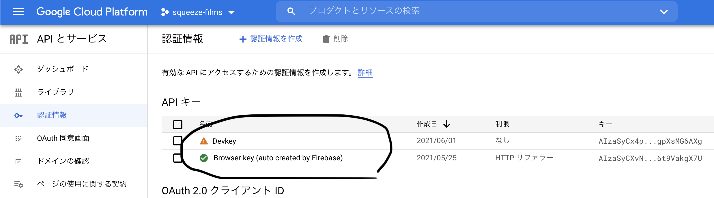
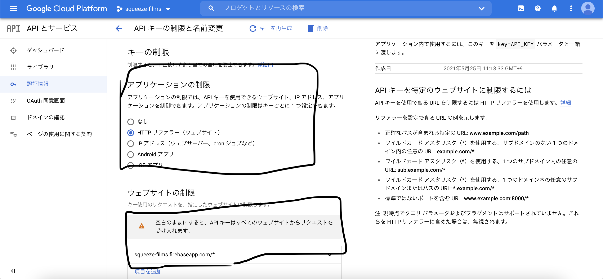
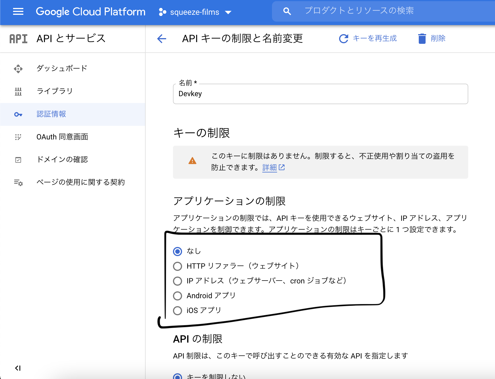

こんにちは。  
まだ機能追加も必要ですが、一通りアプリケーションが形になってきたので、今回は セキュリティについてです。

#### クライアント側の対策

Firebase のセキュリティに入る前に、クライアントサイドでの対応について見ておきます。  
イメージが湧きづらいので、先に完成図を示します。


これが何をしているかというと、下記のようなパターンです。

- Login / Register していない状態で、特定のアクションを行うと、Login / Register を促すモーダルがでる
- モーダルからログインすると、先程見ていたページに戻る
- もし、アクセスが許可されていないページに URL 直打ちで入ろうとすると、モーダルが出る
- Cancel すると、メインページにリダイレクトする

認証されていない場合、アプリケーション内でのユーザの行動を制限するわけですね。  
ボタンなどは、認証していない場合隠せばいいですが、URL 直打ちされるとどうしようもないので、そういった場合の対策を行っています。

ここでは、Private Router と ConnectedRouter を使って実装しています。

#### Private Router

Private Router はライブラリではなく、react-router-dom の Route をラップする HOC です。  
下記のように、auth の状態を確認し、認証されていれば受け取ったコンポーネントに遷移、  
認証されていなければ、UnauthModal というコンポーネントにわたすだけです。

```js
import React from "react"
import { useSelector } from "react-redux"
import { Route } from "react-router-dom"
import UnauthModal from "../../feature/auth/UnauthModal"

export default function PrivateRoute({
  component: Component,
  prevLocation,
  ...rest
}) {
  const { authenticated } = useSelector(state => state.auth)
  return (
    <Route
      {...rest}
      render={props =>
        authenticated ? <Component {...props} /> : <UnauthModal {...props} />
      }
    />
  )
}
```

ただ、この場合だと、先程指摘した URL 直打ちの場合、  
URL のコンポーネント → モーダル表示 →Cancel しても prevLocation がないので、戻れない → 以下ループ  
となってしまい、モーダルを閉じることができなくなってしまいます。  
当然、ログインすれば問題ないですが、Cancel できないというのは少し問題です。

##### ConnectedRouter

そんなときに便利なのが、Connected React Router です。  
これは、ルーターの状態を Redux と同期してくれるものです。現在の場所とかがすぐわかるってことですね。  
導入はやや煩雑なので、[公式](https://github.com/supasate/connected-react-router)で。

##### reducer での使い方

connected-react-router から`LOCATION_CHANGE`を受け取り、Reducer に適応すれば、前回の位置を取得することもかんたんにできてしまいます。

```js
import { LOCATION_CHANGE } from "connected-react-router"

const initialState = {
  prevLocation: null,
}

export default function authReducer(state = initialState, { type, payload }) {
  switch (type) {
    case LOCATION_CHANGE:
      return {
        ...state,
        prevLocation: state.currentLocation,
        currentLocation: payload.location,
      }
    default:
      return state
  }
}
```

あるいは、hiostory という hash ををコンポーネント内で受け取れば、Location から pathname を取得することも可能です。下記は、history の有無によって、条件分岐をしています。  
URL 直打ちでどこかにアクセスすると、当然 prevLocation がないわけですが、その場合は`/shelfs`にリダイレクトしています。

```js
export default function UnauthModal({ history }) {
  const { prevLocation } = useSelector(state => state.auth)

  function handleCancel() {
    if (!history) {
      dispatch(closeModal())
      return
    }

    if (history && prevLocation) {
      history.push(prevLocation.pathname)
    } else {
      history.push("/shelfs")
    }
    dispatch(closeModal())
  }
}
```

#### Firebase の API

[公式](https://firebase.google.com/docs/projects/api-keys)にある通り、Firebase の API は秘匿された文字列ではなく、アドレスみたいなもので、セキュリティ部分は Firebase セキュリティルールによって定義されます。

> 誰かが API キーを入手した場合、 Firebase セキュリティルールで保護されている限り、Firebase プロジェクトのデータベースや CloudStorage データにアクセスすることはできません。

#### Firebase のセキュリティルール

サンプルを見たほうが早いので下記の様な感じです。db ごとに定義していくイメージです。  
おもに、match で DB を指定し、allow 以降に行動と条件を書きます。  
独自に関数定義もできるらしいです。あまりドキュメトをちゃんと読んでないので結構苦戦する。。。

```js
rules_version = '2';
service cloud.firestore {
  match /databases/{database}/documents {
    match /shelfs/{document=**} {
      allow read, list;
      allow create: if isSignedIn();
    }
  }
}

function isSignedIn() {
	return request.auth.uid != null;
}
```

これで firebase 側の要求を満たす場合以外は、DB へのアクセスが出来ません。

#### API key の制限

最終的にデプロイする前には、Google Cloud Platform のほうで制限を API KEY に制限をかけることも必要でしょう。  
開発用の API KEY と本番用の API に分けて、本番用の API は特定ドメインからしかアクセスできないようにしてあげます。







#### 最後に

firebase 特有の部分が多いので、おそるおそるって感じですね。  
何より、デプロイするのはちょっと怖いです。API KEY を使っている以上。。。  
ちょこちょこ手直ししたら、完成になりますね。  
ひとまず此処まで来た自分を褒めたい。。。

#### 参考

- [Connected React Router](https://github.com/supasate/connected-react-router).
- [Firebase の API キーの使用と管理について学ぶ](https://firebase.google.com/docs/projects/api-keys).
- [Firebase セキュリティ ルール](https://firebase.google.com/docs/rules).
- [セキュリティ ルール言語](https://firebase.google.com/docs/rules/rules-language).
