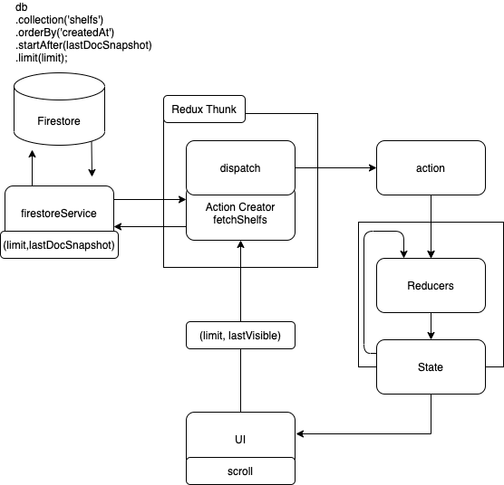

こんにちは。今回は react-infinite-scroller を使っていきます。  
なお、react 17 は未対応のライブラリなので、16.14.0 にバージョンを下げています。  
去年からメンテナンスされていないようですね。  
なんならちょっと挙動が怪しい気がする。。。

そういえば、shelf の複数形が shelves だということに昨日気がついて、めちゃくちゃ恥ずかしくなりました。後で直しとカント、、、

#### react-infinite-scroller

react-infinite-scroller はその名の通り、インフィニットスクロールを可能にしてくれるライブラリです。  
使い方はシンプルなので、[公式](https://github.com/danbovey/react-infinite-scroller)参照。

loadMore に追加読み込みのメソッドを定義してあげる。  
hasMore はまだ追加読み込みできるデータがあるかの判別。

```js
<InfiniteScroll
    pageStart={0}
    loadMore={loadFunc}
    hasMore={true || false}
    loader={<div className="loader" key={0}>Loading ...</div>}
>
    {items} // <-- This is the content you want to load
</InfiniteScroll>
```

#### Firestore での実装

Firestore を使った実装を見ていきます。  
まずはディレクトリ構成と、全体図です。

##### ディレクトリ

ディレクトリ構成は下記です。

```bash
./src
├── app
│   ├── firestore
│        └── firestoreService.js    // firestoreにアクセス
└── feature
     └── shelfs
         ├── shelfActions.js        // ActionCreator
         ├── shelfConstants.js      // アクションタイプ定義
         ├── shelfReducer.js        // Reducer
         └── shelfDashboard
              ├── ShelfDashboard.jsx  // メイン
              ├── ShelfList.jsx       // 今回の対象
              └── ShelfListItem.jsx   // Listに呼び出されるItem
```

##### 概要図

Redux や ReduxThunk が絡むので少し複雑になっています。  
limit という値に一回あたりに何件呼び出すかを指定。  
lastVisible に前回どこまで呼び出したかを記録することによって、firestore から情報を取得する際のクエリに混ぜ込んでいます。

startAfter()と limit()ですね。



それでは、実装について確認していきます。

##### ShelfDashboard.jsx

下記は抜粋です。  
ページがレンダリングされると、useEffect で `fetchShelfs()`して、firestore からデータを取得しています。  
スクロールが実行されると handleFetchMoreShelfs()内部から `fetchShelfs()`を再度呼び出しています。

```js:title=ShelfDashboard.jsx(抜粋)
import React, { useState,useEffect } from 'react';
import ShelfList from './ShelfList';
import { useSelector, useDispatch } from 'react-redux';
import { fetchShelfs } from '../shelfActions';
import { RETAIN_STATE } from '../shelfConstants';

export default function ShelfDashboard() {
  const limit = 2;
  const dispatch = useDispatch();
  const { shelfs, moreShelfs, lastVisible, retainState } = useSelector(
    (state) => state.shelf
  );
  const [isFetching, setIsFetching] = useState(false);

  useEffect(() => {
    if (retainState) return;
    setLoadingInit(true);
    dispatch(fetchShelfs(limit)).then(() => {
      setLoadingInit(false);
    });
    return () => {
      dispatch({ type: RETAIN_STATE });
    };
  }, [dispatch, retainState]);

  async function handleFetchMoreShelfs() {
    try {
      setIsFetching(true);
      await dispatch(fetchShelfs(limit, lastVisible));
    } catch (error) {
      console.log(error);
    } finally {
      setIsFetching(false);
    }
  }

  return (
        <ShelfList
          shelfs={shelfs}
          getNextShelfs={handleFetchMoreShelfs}
          loading={loadingInit}
          moreShelfs={moreShelfs}
          isFetching={isFetching}
        />
  );
}
```

二点注意事項があります。

一点目は`retainState`という値です。  
これは、boolean 値で、初期値は false です。useEffect のクリーンアップで true に変更になります。こうしておかないと、ページ遷移でこのページに戻ってくるたびに、`fetchShelfs()`が実行されて同じ情報を再度取得しにいってしまいます。

二点目は、`isFetching`というフラグです。これは、react-infinite-scroller のバグで、関数が２回実行されるというものに対処するための値です。([参考](https://qiita.com/joe-king-sh/items/32bf2973e9d52eeaf069))  
このフラグを立てても初回のレンダリング時にスクロールしまくると、再現してしまうので、このライブラリ自体もうあまりよくないのかもしれませんね。

##### ShelfList.js

InfiniteScroll を使用している部分です。

```js:title=ShelfList(抜粋)
import React from 'react';
import ShelfListItem from './ShelfListItem';
import InfiniteScroll from 'react-infinite-scroller';

export default function ShelfList({
  shelfs,
  getNextShelfs,
  loading,
  moreShelfs,
  isFetching,
}) {
  return (
    <>
      {shelfs.length !== 0 && (
        <InfiniteScroll
          pageStart={0}
          loadMore={!isFetching && getNextShelfs}
          hasMore={!loading && moreShelfs}
          initialLoad={false}
          threshold={10}
        >
          {shelfs.map((shelf) => (
            <ShelfListItem shelf={shelf} key={shelf.id} />
          ))}
        </InfiniteScroll>
      )}
    </>
  );
}
```

##### shelfActions.js

`fetchShelfs()`です。ここがキモですね。Redux Thunk で関数に包まれています。  
limit と lastDocSnapshot を使って、firestoreService の`fetchShelfsFromFirestore()`を呼び出しています。  
そこで得られた snapshot を使って、次回に呼び出すときのクエリを作成しています。（9、10 行目）  
moreShelf は boolean 値です。  
lastVisible には、今回の snapshot の列の位置を取得しています。長さ - 1 でそれ自体の位置になるので。

firestore の弱いところとして、レコードの全体数がわからないという点があるみたいです。  
レコードを取得してその length を確かめるしかないという縛りがあるため、レコード自体の位置をカーソルとして保持しておいて、それ以降を startAfter で呼び出すという方式にする必要があります。

```js{9,10}:title=shelfActions.js
export function fetchShelfs(limit, lastDocSnapshot) {
  return async function (dispatch) {
    dispatch(asyncActionStart());
    try {
      const snapshot = await fetchShelfsFromFirestore(
        limit,
        lastDocSnapshot
      ).get();
      const lastVisible = snapshot.docs[snapshot.docs.length - 1];
      const moreShelfs = snapshot.docs.length >= limit;
      const shelfs = snapshot.docs.map((doc) => dataFromSnapshot(doc));
      dispatch({
        type: FETCH_SHELF,
        payload: { shelfs, moreShelfs, lastVisible },
      });
      dispatch(asyncActionFinish());
      return lastVisible;
    } catch (error) {
      dispatch(asyncActionError(error));
    }
  };
}
```

##### firestoreService.js

ここでフィルターにかけたりもできるのですが、今回はシンプルにデータを取得しています。

```js:title=firestoreService(抜粋)
export function fetchShelfsFromFirestore(limit, lastDocSnapshot = null) {
  return db
    .collection('shelfs')
    .orderBy('createdAt')
    .startAfter(lastDocSnapshot)
    .limit(limit);
}
```

#### 最後に

firestore と react-infinite-scroller の使い方についてでした。  
firestore からちょっとずつ呼び出すっていう処理が、意外と難しいですね。  
いよいよ大詰めですかね。


#### 参考

- [react-infinite-scroller](https://github.com/danbovey/react-infinite-scroller).
- [react-infinite-scroller で、loadMore が２度動く場合の対処法](https://qiita.com/joe-king-sh/items/32bf2973e9d52eeaf069).
