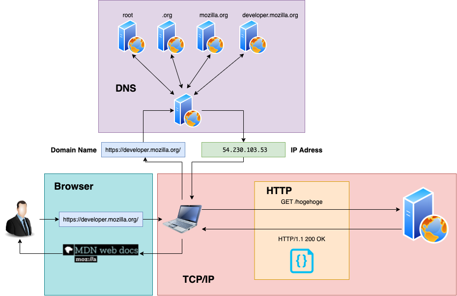

こんにちは。体調を崩してしばらく寝込んでいたのですが、そろそろ就活しないとやべえなと思い始めている今日このごろです。  
Wantedly と Green あたりで応募して、React の案件がありそうな会社を探していきたいと思います。

就活といえば、去年の１０月ごろにちょっとだけやったのですが、○○ って知ってる？系の基礎的な用語の質問にほぼ答えられず、ヘラヘラ笑っていたので全部落ちました。  
今回はそこの反省点を踏まえて、多少予習しておこうかなと思い、WEB DEVELOPER Roadmap に出てくるタームをかんたんに整理していきたいと思います。

あと、何の言語書けるの？って聞かれたときにどうするかですが、ひとまず JavaScript にしたいので、文法的復習もやっていきたいと思います。  
昨日 paiza の問題を C++で解いてみましたが、ガッツリ忘れていたのもあり C++で行くのは不安もあるので。。。  
paiza では、B 問題はなんとか解けましたが、A 問題で探索系の問題が出てきて、諦めました。幅優先探索とかの実装の仕方すっかり忘れています。

#### WEB DEVELOPER Roadmap とは

WEB DEVELOPER Roadmap とは、様々な技術やツールについて学ぶためのガイドです。毎年改訂されていて、最新のトレンドも取り込まれているので、移り変わりの早い WEB 界隈では重宝しそうですね。

今回は、[こちらの記事](https://zenn.dev/kkeeth/scraps/dd30ae9d48f092)を参考に、必須の用語について整理していきたいと思います。  
参考文献は MDN、『Web を支える技術』と『Amazon Web Services 基礎からのネットワーク＆サーバ構築』です。

#### Internet

インターネット全体に関わる仕組みについてです。MDN にだいたい書いてありそう。

##### How does the Internet work?

MDN の概要は下記のとおりです。  
インターネットと Web って違うものなんですね。

> インターネットは Web のバックボーンであり、Web を可能にする技術基盤です。最も基本的なインターネットは、すべてが一元的に通信を行う大規模なコンピュータネットワークです。

インターネットはそもそもコンピュータ同士をつなぐ技術を指し示す言葉のようです。ルーターや光回線、そういった物理的なつながりのイメージでしょうか。

> インターネットはインフラですが、Web はインフラの上に構築されたサービスです。

では、Web とはどのように働くものでしょうか。

##### How the Web works

ウェブ上のコンピュータは、クライアント (client) とサーバー (server) 方式により接続されます。  
MDN では、ウェブを道路にたとえ、クライアントを自宅、サーバをお店と捉えています。こういうところ、海外の考え方って具体的で面白いですね。ウェブの理解には、下記の技術が必要です。

- インターネット接続：ウェブ上でデータの送受信を可能にする
- TCP/IP：ウェブ上のデータのやりとりの通信プロトコル
- DSN：Domain Name Servers はウェブサイトの住所録のようなもの
- HTTP：Hypertext Transfer Protocol はクライアント・サーバの対話方法についてのプロトコル
- コンポーネントファイル
  - コードファイル：HTML,CSS,JavaScript など
  - アセット：画像、音楽、動画など
  - HTML→DOM ツリー生成 →CSS にスタイル →JavaScript の順

なんでも図示するのが好きなので、ざっくり書いてみました。



なお、Web は REST と呼ばれるアーキテクチャスタイルによって構築されています。

##### What is REST?

REST は Web のアーキテクチャスタイルです。アーキテクチャスタイルとは、設計思想、方針、流儀のようなもので、あくまで実装とは異なる概念です。

REST は下記の複合的な概念の塊です。長くなるので、詳細は割愛しますが、例えば HTTP というのは、クライアント・サーバのアーキテクチャスタイルを採用したプロトコルということになります。

- クライアント・サーバ
- ステートレス
- キャッシュ
- 統一インターフェース
- 階層化システム
- コードオンデマンド

##### What is Domain Name?

ドメイン名とは、IP アドレスと同様に、インターネット上の住所です。IP アドレスと同様に一意性が保たれる必要があります。

ピリオドで区切られた構造をしており、IP アドレスと共に ICANN という団体が統括管理しています。ICANN の配下に、「com」「net」を管理する Versign や、「jp」を管理する JPRS などがあり、更にその下に指定事業者がいます。これらの管理組織のことを「レジストリ」というそうです。

```js
www.example.co.jp

// トップレベル：jp
// 第２レベル　 ：co
// 第３レベル　 ：example
// 第４レベル　 ：www
```

##### DNS and how it works?

DNS とは、ドメインを IP アドレスに変換する仕組みのことで、IP アドレスを引き出すことを「名前解決」といいます。

名前解決は、「ルート DNS サーバー」から始まり、「トップレベル」「第２レベル」「第３レベル」のように、階層的に処理されていき、最終的に対応する IP アドレスを取得します。

例えば、最初にルートサーバに「`https://developer.mozilla.org/`」を渡すと、「org サーバ」を見に行けばいいよ、と教えてくれて、それを順繰りにしていく感じです。

##### What is HTTP?

HTTP は HTML 文書などのリソースをクライアントとサーバ間でやりとりするためのプロトコルです。

TCP/IP をベースとした技術です。階層としては、アプリケーション層に位置します。下記のような特徴を持ちます。

- クライアント・サーバ
- リクエスト・レスポンス：ブラウザはリクエストをおくり、サーバはレスポンスを返す
- ステートレス：サーバがクライアントの状態を制御しない

##### Browsers and how they work?

[MDN](https://developer.mozilla.org/ja/docs/Web/Performance/How_browsers_work)にとてもわかりやすい解説があります。

- ナビゲーション：下記の３つを実行してからリクエストを送ります
  - DNS ルックアップ：名前解決
  - TCP ３ウェイハンドシェイク：コネクションの確立
  - TLS ネゴシエーション：HTTPS によるコネクションの確立
- レスポンス：サーバがレスポンスを返します
- パース処理：データを DOM と CSSOM に変換します
  - DOM ツリー：HTML をブラウザ向けの内部表現に変換します
  - CSSOM：CSS を処理して CSSOM ツリーを構築します
- レンダリング：パースされたデータをレンダーツリー形式へ組み合わせます
- インタラクティビティ：JavaScript などが実行されます

##### What is hosting?

[MDN 最強](https://developer.mozilla.org/ja/docs/Learn/Getting_started_with_the_web/Publishing_your_website)なのでペタリ。

#### 最後に

今回はここまでです。記事がかさばってきたので、タグ機能つけたいですね。  
Gatsby Tutorial をやればいいとわかってはいるんですが、体調が良くならないので、なかなか食指が動きません。  
今日はあとで企業の選定でもします。

#### 参考

- [Developer Roadmaps](https://roadmap.sh/)
- [Frontend Developer](https://roadmap.sh/frontend)
- [WEB DEVELOPER Roadmap 2021 の Frontend Developer を見ての振り返り](https://zenn.dev/kkeeth/scraps/dd30ae9d48f092)
- [MDN](https://developer.mozilla.org/ja/)
- 『Web を支える技術』山本陽平, 技術評論社(2010)
- 『Amazon Web Services 基礎からのネットワーク＆サーバ構築』大澤文孝, 他, 日経 BP(2014)
- [ページの生成：ブラウザーはどのように動作するか](https://developer.mozilla.org/ja/docs/Web/Performance/How_browsers_work)
