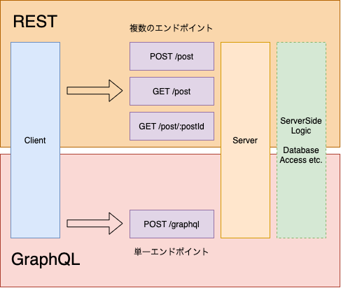

こんにちは。今回は、MVC と SQL と NoSQL と REST と GraphQL について見ていきます。  
記事を分割するのがめんどうだったのでごっちゃになってます。

#### MVC

Model View Controller の略称です。  
関心事を分離することを目的としたアーキテクチャパターンになります。

- Model：データを表現する部分で、データの更新や fetch など
- View：ユーザが見る部分、レンダリングを担当する
- Controller：Model と View をつなぐ部分。Model で得たデータを View にわたすなど、中間的なロジックが存在する。ミドルウェアによって分割されていることもある

- Routes：ルーティングは Controller に紐づく

Express の場合だと、model は class で記述するっぽい（？）ですね。関数型でも書けるのでしょうか。
ひとまず概念的な部分だけで。

#### SQL

database を使う目的は、データを保存し、効率的にアクセスするためです。  
ファイルへのアクセスより高速に稼働します。

SQL はテーブルを複数もち、それぞれ id や title などのフィールドを持っています。  
そしてテーブル同士、列同士が関連付けられ、順序付けされることで高速にデータが取得できます。

SQL の特色としては下記があります。

- Data Schema：フィールドの種類や型が決められている
- Data Relations：一対一、一対多、多対多の関係をもてる
- SQL Queries：構造化クエリ言語でアクセスする

#### NoSQL

NoSQL は SQL とは異なる焦点を持つ考え方  
階層化された下記３つから構成される。ファイルシステムに近い。

- Database：おおもとのデータベース
- Collections：Users や Orders などのテーブル
- Documents：json などで記述されるレコード。それぞれ、保有するフィールドが全く同じとは限らない

NoSQL の特色としては、ネストした形で、他の Collection の値を保持する構造であること  
つまり、同じデータが複数の Collection に保持される可能性があり、重複します。  
データの更新なども複数箇所におよびますが、一方でテーブルの結合がないので高速に動きます。

- No Data Schema
- No Data Relations

firestore とかまさにこれでしたね。

#### SQL vs NoSQL

高速で稼働するデータベースを考える上では、スケーリングが問題になります。
スケーリングの種類としては、水平スケーリングと垂直スケーリングがあります。

- Horizontal Scale：サーバの台数を増やす
- Vertical Scale ：CPU やメモリでハードウェアを強化する

以上を前提とすると Data Schema の違いでスケーリングの方針が変わります。

- SQL ：水平スケーリングが難しいあるいは不可能
  - Read のみなら水平スケーリングしても問題ないが、保存する際にメモリやマシンの容量をオーバーすると半端なデータが発生するため、サーバ間でデータ分割が必要になり複雑（sharding とか言うらしい）
- NoSQL：レコードが情報を保持しているので、水平スケーリングが簡単

頻繁にアクセスがないデータの場合であれば、SQL は有用です。  
一方で、大量に高速にアクセスが必要な場合は、NoSQL に軍配が上がります。

#### REST

##### REST API が必要な理由

全ての UI が html を必要としているわけではないので、Node.js(サーバサイド)で html をレンダリングしなくてもよい。下記の例などまさにその典型で、フロントエンドとバックエンドでは、REST API を介してデータの授受が行われている。

- Mobile app ：Apple や Google が提供する UI で実装
- Single Page app ：React や Vue などで実装
- Service API ：Google Map など、json 形式でレスポンス

同じバックエンドの API から Mobile、SPA どっちのも返答することもある。

#### GraphQL

##### GraphQL とは

GraphQL は REST と同じくステートレスで、クライアントに依存しない API ですが、クエリの柔軟性が高いらしいです。

##### REST の限界

REST API で、GET /post のエンドポイントがあった場合、post のすべてのデータを取得することになる。  
post の title だけがほしい場合の解決策はいくつかある。

- 解決策１：title だけを受け取るためのエンドポイントを作成する（GET /post-slim）
- 解決策２：クエリパラメータを渡す。しかしバックエンドが煩雑になる（GET /post?data=slim）
- 解決策３：フロントエンドで不要なデータを削る

いずれにしても無駄が多い。これらの問題を解決するのが GraphQL とのこと。

##### GraphQL の原理

GraphQL は単一エンドポイントで、サーバサイドで実行可能なクエリをわたします。  
つねに post で渡すのも特徴っぽいです。



```js
{
  query{    // Operation type
    user{   // Operation endpoint
      name  // Requested fields
      age
    }
  }
}
```

##### Operation type

Operation type は３つあります。

- Query ：データの読み取り、GET に相当
- Mutation：データの更新や削除など
- Subscription：Websocket のリアルタイム通信で使うみたい

##### Resolver

Operation type をサーバサイドの Resolver と呼ばれるものが判別し、データを返します。  
Contorller みたいなやつらしい。

#### 最後に

今回は Udemy の NodeJS の講座を見つつ、MVC、SQL vs NoSQL、REST vs GraphQL を見てきました。それぞれの技術の違いがよくわかったので大変有意義でした。
