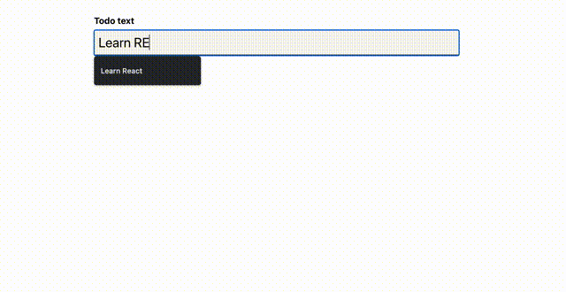

こんにちは。今回は、React + TypeScript についてです。

#### TypeScript とは

JavaScript のスーパーセットで、JavaScript を拡張するもの。  
JavaScript に静的型付けを導入することができる。

#### TypeScript のメリットは？

いくつかあるみたいですが、下記のようなものが挙げられます。

- 型チェックが強力
- 入力補完が可能
- JavaScript のスーパーセットなので古いバージョンへのトランスパイルできる

#### 導入

ひとまず、この二行

```bash
npm install typescript --save-dev
```

```bash
npx tsc ファイル名
```

#### 型定義

typescript では、`: 型`という形で、いろいろ定義できる。  
プリミティブ型、配列、オブジェクトだと下記の様な感じ。

```js
let age: number
age = 12

let hobbies: string[]
hobbies = ["Sports", "Coocking"]

let person: {
  name: string,
  age: number,
}

person = {
  name: "Max",
  age: 32,
}

let anything: any // 基本的に使わないほうがいい
```

なお、ts では型定義を行っていないと、型推論をしてチェックしてくれる。便利なやつ。

#### Union Types

型を組み合わせて定義することができる

```js
let sentence: string | number
sentence = "Max"
sentence = 12
```

#### Type Aliases

型を使い回すために alias を定義できる。  
コードが節約できるので大事。

```js
type Person = {
  name: string,
  age: number,
}

let person: Person
```

#### 関数と型

パラメタにも引数にも型を定義できる

```js
function add(a: number, b: number): number {
  return a + b
}

// 何も返さないときのみ、voidを定義する
function print(value: any): void {
  console.log(value)
}
```

#### ジェネリクス型

Generics とは、実際に利用されるまで型がわからないものに対して、抽象的な型引数を定義するものです。  
柔軟でありながら型安全な表現が可能になります。

```js
function insertAtBegginning<T>(array: T[], value: T) {
  const newArray = [value, ...array]
  return newArray
}

const numberArray = insertAtBegginning([1, 2, 3], -1)
const stringArray = insertAtBegginning(["a", "b", "c"], "d")
```

#### create-react-app with TypeScript

[公式](https://create-react-app.dev/docs/adding-typescript/)を見ればよし。

```bash
npx create-react-app my-app --template typescript
```

#### コンポーネントの基本

コンポーネントを作る際には、react に定義されている`React.FC`（functional component）を利用する。  
`<>`の中には、詳細な props の型を定義することができる。

```js
import React from "react"

const Todos: React.FC<{ items: string[] }> = props => {
  return (
    <ul>
      {props.items.map(item => (
        <li key={item}>{item}</li>
      ))}
    </ul>
  )
}

export default Todos
```

この時、呼び出し元のコンポーネントで、props が渡されてないと、型チェックが走ってエラーになる。  
とはいえ、補完でサクッと書けるので、開発体験的にはよい。

```js
import Todos from "./components/Todos"
import "./App.css"

function App() {
  return (
    <div>
      // <Todos /> ← error!
      <Todos items={["Learn React", "Learn TypeScript"]} />
    </div>
  )
}

export default App
```

#### type を class で定義する

type は`type`や`interface`や`class`で定義できる。  
下記の場合は、class で定義している。これの優れている点は、インスタンス化して使ってもいいし、type として使ってもいいという点。ちなみに、[この記事](https://zenn.dev/luvmini511/articles/6c6f69481c2d17)を読むと、2021 年現在は interface ではなく type でもよさそう。

```js
class Todo {
  id: string
  text: string

  constructor(todoText: string) {
    this.text = todoText
    this.id = new Date().toISOString()
  }
}

export default Todo
```

#### サンプルで作った Todo リスト

useState や useRef の型定義がちょっと癖ある。  
HTMLInputElement っていうのがあるらしい、、、ということしかわからなかった。

あと、Todos→TodoItem に onRemoveTodo を渡すときに bind()ってのが出てきた。  
[MDN](https://developer.mozilla.org/ja/docs/Web/JavaScript/Reference/Global_Objects/Function/bind)によると bind() メソッドは、呼び出された際に this キーワードに指定された値が設定される新しい関数を生成するとのことなので、新しい関数として定義し直してわたしてるわけですね。わかりにくい。

関数型で React 書いていたから、class とか this とか bind とか馴染みが無い。

```js:title=App.tsx
import { useState } from "react";

import NewTodo from "./components/NewTodo";
import Todos from "./components/Todos";
import Todo from "./models/todo";

function App() {
  const [todos, setTodos] = useState<Todo[]>([]);

  const addTodoHandler = (todoText: string) => {
    const newTodo = new Todo(todoText);

    setTodos((prevTodos) => {
      return prevTodos.concat(newTodo);
    });
  };

  const removeTodoHandler = (todoId: string) => {
    setTodos((prevTodos) => {
      return prevTodos.filter((todo) => todo.id !== todoId);
    });
  };

  return (
    <div>
      <NewTodo onAddTodo={addTodoHandler} />
      <Todos items={todos} onRemoveTodo={removeTodoHandler} />
    </div>
  );
}

export default App;
```

```js:title=Todos.tsx
import React from "react";

import Todo from "../models/todo";
import TodoItem from "./TodoItem";
import classes from "./Todos.module.css";

const Todos: React.FC<{ items: Todo[]; onRemoveTodo: (id: string) => void }> = (
  props
) => {
  return (
    <ul className={classes.todos}>
      {props.items.map((item) => (
        <TodoItem
          key={item.id}
          text={item.text}
          onRemoveTodo={props.onRemoveTodo.bind(null, item.id)}
        />
      ))}
    </ul>
  );
};

export default Todos;
```

```js:title=TodoList.tsx
import React from "react";
import classes from "./TodoItem.module.css";

const Todos: React.FC<{
  text: string;
  onRemoveTodo: () => void;
}> = (props) => {
  return (
    <li className={classes.item} onClick={props.onRemoveTodo}>
      {props.text}
    </li>
  );
};

export default Todos;
```

```js:title=NewTodo.tsx
import { useRef } from "react";
import classes from "./NewTodo.module.css";

const NewTodo: React.FC<{ onAddTodo: (text: string) => void }> = (props) => {
  const todoTextInputRef = useRef<HTMLInputElement>(null);

  const submitHandler = (event: React.FormEvent) => {
    event.preventDefault();

    const enteredText = todoTextInputRef.current!.value; // null はありえない場合、?の代わりに!にする

    if (enteredText.trim().length === 0) {
      // throw an error
      return;
    }

    props.onAddTodo(enteredText);
  };

  return (
    <form onSubmit={submitHandler} className={classes.form}>
      <label htmlFor="text">Todo text</label>
      <input type="text" id="text" ref={todoTextInputRef} />
      <button>Add Todo</button>
    </form>
  );
};

export default NewTodo;
```

##### Todo with TypeScript



#### Context API

直接は関係ないけど、Context API を使ったリファクタリングの例が出てきたけど、そもそも Context API ってなんだっけと思ったので、備忘録。

> コンテクストは各階層で手動でプロパティを下に渡すことなく、コンポーネントツリー内でデータを渡す方法を提供します。

というのが公式のヘッダ文。Redux みたいなやつらしい。ただし、[別の記事](https://qiita.com/tatakahashiap/items/5eeef43cd5f9b954ad6f)を読んでいると、使い所がちょっと違うみたいです。

保有している udemy の react 講座の内容が刷新されて、context api についてもあるみたいだから、時間があるときにやってみましょうかね。

#### React with TypeScript の参考

[crate-react-app](https://create-react-app.dev/docs/adding-typescript/)の Getting Started with TypeScript and React や、[TypeScript 学習ロードマップ](https://qiita.com/irico/items/33744e15a4e0ca52d6bc)が参考になりそう。サバイバル TypeScript とかおもしろそうですね。

以前 Udemy で TypeScript の講座とってなるほど！と思ったけど今何も覚えていないので、そこから復習でもいいかも。

#### 最後に

react + typescript になんとなく入門できた気がしました。  
今のところ、大変そうという感想しか抱いていませんが、今後は基本的に ts で書いていきたいと思っているので、簡単なアプリをいくつか実装してみようと思います。  
それにしても、明日からいくつか面談あるけど、どこにも受かる気がしませんね笑。どうしたものやら

#### 参考

- [TypeScript](https://www.typescriptlang.org/download).
- [create-react-app typescript](https://create-react-app.dev/docs/adding-typescript/)
- [interface と type の違い、そして何を使うべきかについて](https://zenn.dev/luvmini511/articles/6c6f69481c2d17)
- [bind](https://developer.mozilla.org/ja/docs/Web/JavaScript/Reference/Global_Objects/Function/bind)
- [TypeScript 学習ロードマップ](https://qiita.com/irico/items/33744e15a4e0ca52d6bc)
- [React Context API は Redux の代替となるか](https://qiita.com/tatakahashiap/items/5eeef43cd5f9b954ad6f)
