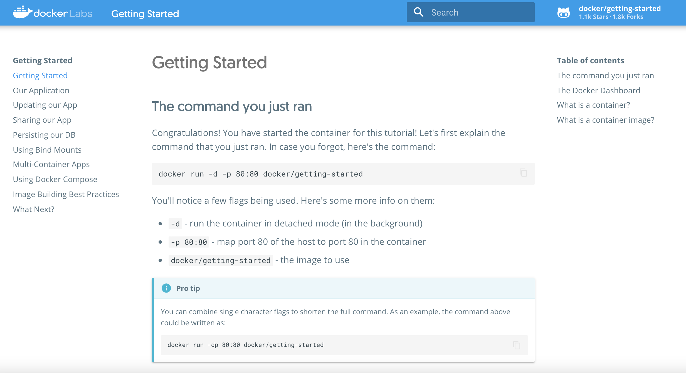
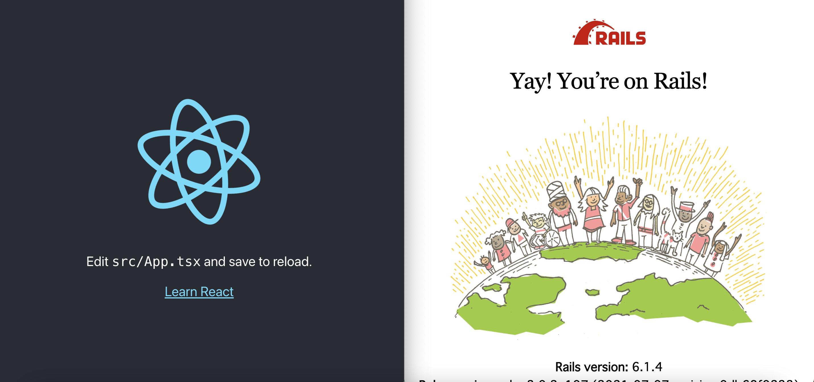
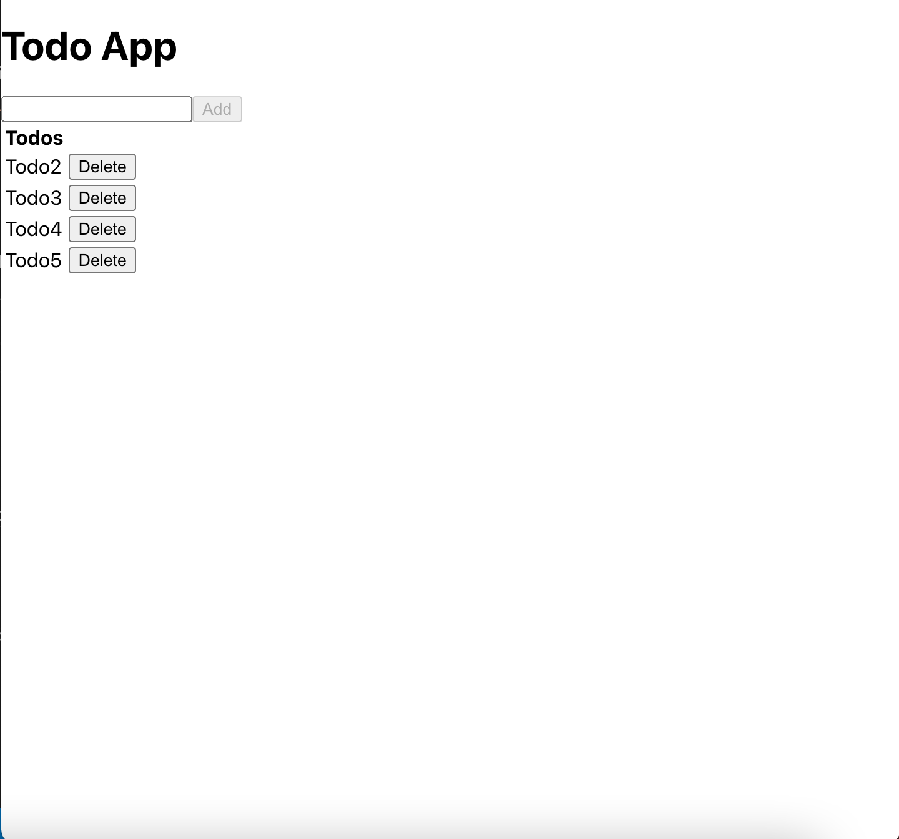

こんにちは。今回は、Rails API ✕ React ✕TypeScript の構成で Todo アプリを作ってみたいと思います。  
というかまあ、[こちらの記事](https://qiita.com/kazama1209/items/5c07d9a65ef07a02a4f5)さんを試しにやってみるということです。  
いろいろな会社さんとカジュアル面談をさせていただいていますが、Web 系だとやっぱり Rails でものづくりしているところも多く、久々に Rails を触ってみたいと思ったのが動機です。

#### docker 入門

docker という何やら便利なやつがいるのは知ってますが、使ったことないので、サクッと導入してみます。

初期チュートリアルが終わって、Gettting stared の画面

なんかわからんけどヨシ！

#### 環境構築

[こちらの記事](https://qiita.com/kazama1209/items/5c07d9a65ef07a02a4f5)の通りに構築。docker-compose.yml に設定が書いてあるみたい。  
ひとまず今は細かいことはわからないので、[クィックスタート](https://docs.docker.jp/compose/rails.html)なんかも流し見しつつ、構築されるのを待つ。  
Compose は、Dockerfile で定義されたもの（今回でいうと、api や front）などに対してイメージをビルドし、そのイメージに対して、`rails new`や`yarn create react-app react-app --template typescript`したりするらしいです。

何やら起動に成功！

#### 実装

ここもコードをペタペタ貼るだけなので、作業的にやってみます。  
api に`curl`するところで、migrate してないぞって 500 ステータスが返ってくるので、migrate してあげましょう（`docker-compose run api rails db:migrate`）。書くまでもなく、seed でデータ作ったら migrate するよねってことかもしれませんが。

##### CORS 設定

url や暗号化方式が違うとセキュリティ的にアクセスできないってやつですね。  
概念的には知っていますが、初対面です。gem のコメントアウトを外せば楽に設定できました。

#### 完成

とくに引っかかるところもなく出来ました。
`./frontend/react-app/src/lib/api/todos.ts`の`ceateTodo`はタイポですね。

#### 最後に

今回わかったことは下記です。API での連携って実装したことなかったので、中身がなんとなく見れてよかったです。

- docker がすごい。めっちゃ楽。ただし設定ファイルの中身を知るのが大変そう
- Rails API は、コントローラで ビューの代わりに json 返してるだけ（他の実装方法あるかもしれませんが）
- React✕TypeScript 側は Rails を全然意識しなくていい。

Rails のうっすらとした記憶でも読んだらなんとなくわかってよかったです。  
いま就活していると、フロントエンドもバックエンドも JavaScript/TypeScript ってのはあまりないっぽくて、バックエンドは既存の Rails のものを API モードで使っているよというお話をちょこちょこ聞きました。  
それで今回触ってみたわけですが、フロント側としては、別に Rails だろうが Node だろうが、意識しなくて済みそうですね。  
あと、docker はやっぱり必須っぽいので、勉強したいなと思いました。Udemy の講座買ったら、最初の動画でやたら難しいぞって脅されてそのまま見てないので、挑戦してみないと、、、  
先行きがわからないので、早くどこかの企業さんに拾われたいですね笑。

#### 参考

- [Rails API × React × TypeScript で作るシンプルな Todo アプリ](https://qiita.com/kazama1209/items/5c07d9a65ef07a02a4f5)
- [クィックスタート: Compose と Rails](https://docs.docker.jp/compose/rails.html)
