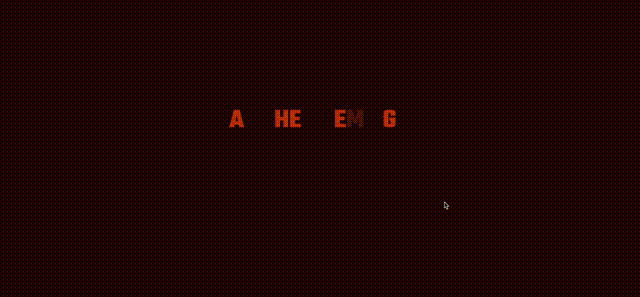

こんにちは。今回は、ふと作りたくなったものを作るシリーズです。  
『バードマン-あるいは（無知がもたらす予期せぬ奇跡）』の映画の OP がかっこよくて、ちょっと真似したくなったのでやってみました（もともとはゴダールのオマージュらしいです）。

表示しているのはブコウスキーの詩です。特に深い意味はないですが、バードマンがカーヴァーだったので、好きな作家つながりで見繕ってみました。

基本的には構成は React✕Next.js✕GSAP となっています。主に GSAP の部分にフォーカスして解説をしておこうと思います。

#### 完成版



[ソース](https://github.com/tsuka-ryu/like-bird-man)

#### Next.js プロジェクトの作成

特に特別なことはなく`birdman`というプロジェクトを作成します。  
TypeScript を使おうと思いつつサボってしまう。

```bash
npx create-next-app birdman
```

#### Google フォントを使う

[\_document.js](https://nextjs.org/docs/advanced-features/custom-document)という設定拡張用のファイルを作ってあげて、その中の`Head`で読み込めばいいらしいです。今回は`Teko`というフォントを使います。  
title や meta タグなんかは、\_app.js のほうに書かないと [warning](https://nextjs.org/docs/messages/no-document-title) がでます。

```js:title=_document.js
import Document, { Html, Head, Main, NextScript } from 'next/document';

class MyDocument extends Document {
  static async getInitialProps(ctx) {
    const initialProps = await Document.getInitialProps(ctx);
    return { ...initialProps };
  }

  render() {
    return (
      <Html>
        <Head>
          <link
            href='https://fonts.googleapis.com/css2?family=Teko:wght@700&display=swap'
            rel='stylesheet'
          />
          <title>AS THE POEMS GO</title>
          <meta
            name='viewport'
            content='initial-scale=1.0, width=device-width'
          />
        </Head>
        <body>
          <Main />
          <NextScript />
        </body>
      </Html>
    );
  }
}

export default MyDocument;
```

#### fontawesome を使う

案外日本語での記事がなくて手間取りましたが、[公式](https://fontawesome.com/v5.15/how-to-use/on-the-web/using-with/react)を見るのが一番てっとり早かったです。

```bash
  npm i --save @fortawesome/fontawesome-svg-core
  npm install --save @fortawesome/free-solid-svg-icons
  npm install --save @fortawesome/react-fontawesome
```

今回は github のアイコンがほしいので、追加します。

```bash
npm install --save @fortawesome/free-brands-svg-icons
```

```js:title=Title.js(一部抜粋)
import { FontAwesomeIcon } from '@fortawesome/react-fontawesome';
import { faGithub } from '@fortawesome/free-brands-svg-icons';

export default function Title() {
  return (
    <section>
      <a href='https://github.com/tsuka-ryu/like-bird-man'>
        <FontAwesomeIcon icon={faGithub} className='github' />
      </a>
    </section>
  );
}
```

#### GSAP の導入

Next.js での GSAP の使い方については、公式のサンプルがあるらしいです。[こちらの記事](https://qiita.com/masakinihirota/items/60c687427b1092cf072d)に日本語で解説があって大変助かります。GSAP のサンプルは、[これ](https://github.com/vercel/next.js/tree/canary/examples/with-gsap)です。

ひとまず、インストールしてあげましょう。

```bash
npm install gsap
```

#### ScrollTrigger の登録

ScrollTrigger を登録してあげます。  
title とか one とかはコンポーネントです。

```js:title=index.js
import { gsap } from 'gsap';
import { ScrollTrigger } from 'gsap/dist/ScrollTrigger';

import Title from '../components/Title';
import One from '../components/One';
import Two from '../components/Two';
import Three from '../components/Three';

export default function Home() {
  gsap.registerPlugin(ScrollTrigger);
  return (
    <div>
      <Title />
      <One />
      <Two />
      <Three />
    </div>
  );
}
```

#### バードマン風の アニメーションを作る

やっとメインどころまでたどり着きました。  
基本的には全部同じなので、One コンポーネントで説明していきます。

##### import

textAnimation は独自で実装した関数です。

```js:title=One.js
import { useEffect, useRef } from 'react';
import { gsap } from 'gsap';
import { textAnimation } from '../utility/textAnimation';
```

##### 宣言部

ただの js で gsap を使う場合は、主にクラス名で指定しますが、React の場合は、scrolltrigger のトリガーとなる要素を useRef で定義しています。  
そして timeline()を作成しています。  
これを書きながら思いましたが、text の ref は使ってないですね笑。

```js:title=One.js
export default function One() {
  let one = useRef(null);
  let text = useRef(null);
  const content =
    "AS THE POEMS GO INTO THE THOUSANDS YOU REALIZE THAT YOU'VE CREATED VERY LITTLE.";
  useEffect(() => {
    let tl = gsap.timeline({
      scrollTrigger: {
        trigger: one,
        start: 'top top',
        end: 'bottom center',
      },
    });
    textAnimation(tl, content, 'one');
  }, [one]);
```

##### コンポーネント部

上で定義した`content`を span タグで囲んでクラス名をつける処理をしています。  
例えば、ただの`A`をという文字は下記のようになります。

```html
<span class="title-a">A</span>
```

```js:title=One.js
return (
    <section className='one' ref={(el) => (one = el)}>
      <div className='text' ref={(el) => (text = el)}>
        {content.split('').map((value, index) => (
          <span
            key={index}
            className={
              value !== ' ' && value !== '.' && value !== ',' && value !== "'"
                ? 'one-' + value.toLowerCase()
                : null
            }
          >
            {value}
          </span>
        ))}
      </div>
    </section>
  );
```

さて、あとは textAnimation を定義してあげれば完了です。

#### textAnimation

ここでは、使用されているアルファベットを抽出して、それぞれ timeline にアニメーションの情報を登録しています。

```js:title=textAnimation.js
export function textAnimation(tl, content, page) {
  const set = [
    ...new Set(
      content.split('').filter(function (value) {
        return value !== ' ' && value !== '.' && value !== ',' && value !== "'";
      })
    ),
  ].sort();
  let index = 0;
  for (let s of set) {
    const tmp = String(s).toLowerCase();
    tl.fromTo(
      `.${page}-${tmp}`,
      { opacity: 0 },
      { opacity: 1, duration: 0.5 - (index / set.length) * 0.5 }
    );
    index++;
  }
}
```

例えば、"THIS IS ONE"という文章であれば、filter で不要な空欄を取り除いた上で、set に登録すると`{T, H, I, S, O, N, E}`というオブジェクトができるので、スプレット構文で配列にした上で、sort してあげると、`[E, H, I, N, O, S, T]`となります。

そして、そのアルファベットごとにアニメーションを定義します。`E`であれば、`tl.fromTo('.e-one', ...)`となるわけです。

同じアルファベットは同時に表示されるので、同じクラス名、というシンプルな作りになっています。これで完成です。

#### 最後に

今回は、ふと思いついたものを作ってみました。  
記述量は少ないですが、記事を書くために見直しているとおかしな箇所が２，３は見つかったので、やっぱり見直しやリファクタリングは大切ですね。
次は Three.js で遊んでみたいと思っていますが、このブログもそろそろ記事が増えてカオスになってきたので、タグや検索機能を実装したい気もします。

というかブログそのもののデザインもダサいしポートフォリオもダサいから作り直したいし、いろいろやりたくなっています。
仕事はなかなか見つかりませんが、毎日なにか作る努力はしていきたいと思います笑。

#### 参考

- [\_document.js](https://nextjs.org/docs/advanced-features/custom-document)
- [no document title](https://nextjs.org/docs/messages/no-document-title)
- [fontawesome - React](https://fontawesome.com/v5.15/how-to-use/on-the-web/using-with/react)
- [Next.js 公式 examples 集を分類（2021 年 7 月版）](https://qiita.com/masakinihirota/items/60c687427b1092cf072d)
- [with-gsap](https://github.com/vercel/next.js/tree/canary/examples/with-gsap)
