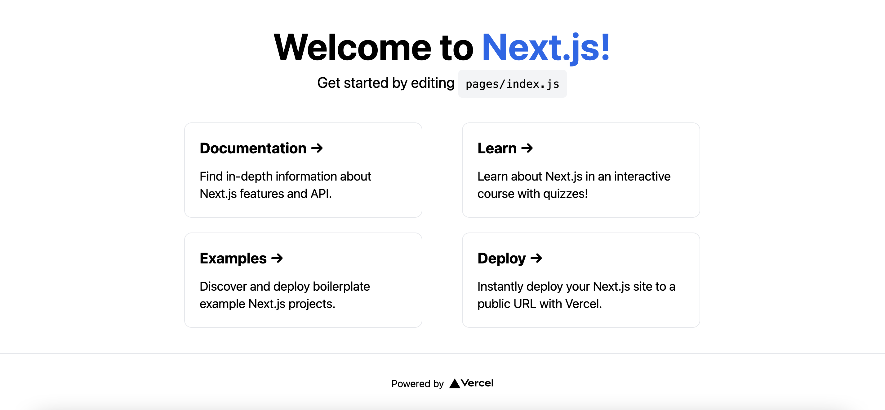
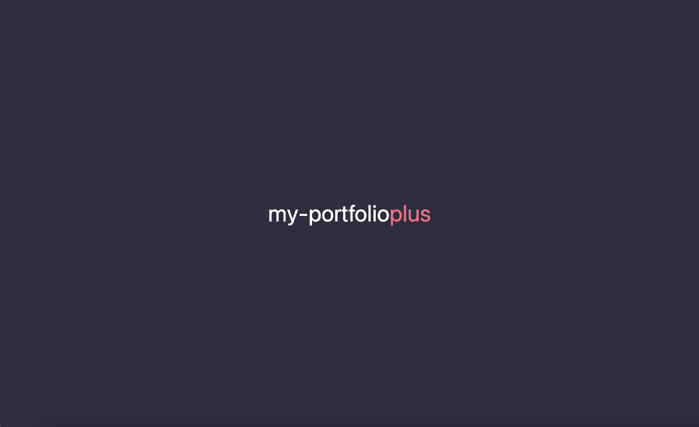
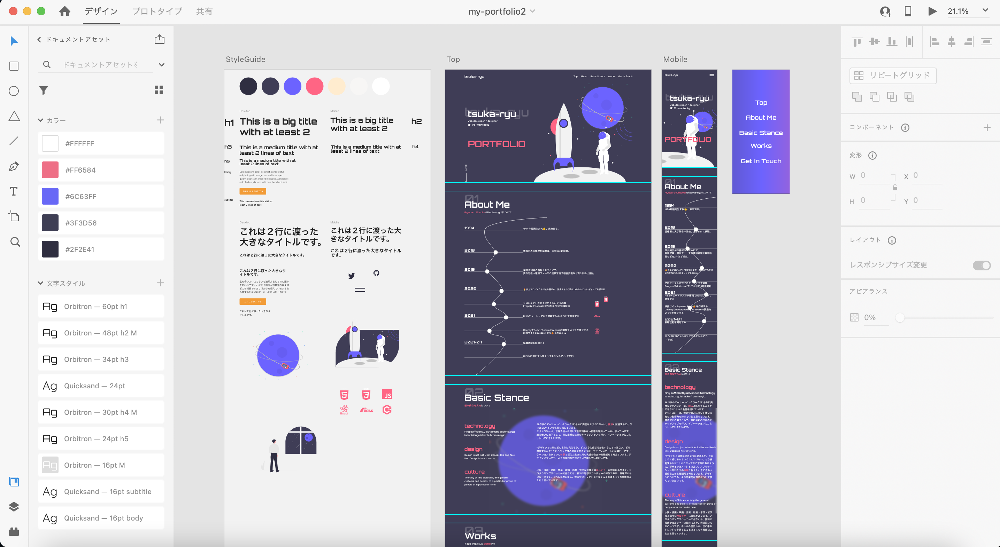

こんばんは。就職活動って難しいですね。なかなか決まる気がしません。  
５月ごろに作ったポートフォリオを見直していたらダサかったので、ちょっと作り直すことにしました。  
デザインと内容は引き継ぎつつ、構成を Next.js✕TypeScript✕Tailwind CSS にしてみます。  
使ったことない技術マシマシで大丈夫かわかりませんが、ひとまずやってみます。

#### Next.js✕TypeScript✕Tailwind CSS のプロジェクトの作成

記事によって導入の仕方がまちまちなんですが、npx でにどっちも入れる方法はないみたいですね。  
[Create Next App](https://nextjs.org/docs/api-reference/create-next-app)を読むと、`-ts`っていうフラグと、`-e`ってフラグがあって、試してみましたが共存出来ないみたいです。実態はどちらも`-e`ってことなんでしょうか。

[Tailwind](https://tailwindcss.com/docs/guides/nextjs)と[TypeScript](https://nextjs.org/docs/basic-features/typescript)の導入手順を比べると Tailwind のほうがめんどくさそうなので、Tailwind が設定済みのプロジェクト →TypeScript 導入という下記のコマンドで入れていきます。  
ちなみに詳細な TypeScript 化手順は[これ](https://nextjs.org/learn/excel/typescript)みたいです。  
index.js や component のサンプルがありました。

```bash
npx create-next-app -e with-tailwindcss my-project
npm install --save-dev typescript @types/react  // 警告が出た場合
npm run dev
```

`.js`を`.tsx`に書き換えてセッティングは完了です。  
見た目からはわかりませんが。



#### `.js`→`.tsx`を詳しく

TypeScript もわからないのに、`.js`を`.tsx`に書き換えって何やねんということで、詳しく記録しておきます。  
[これ](https://nextjs.org/learn/excel/typescript/nextjs-types)を参考に、ゴリゴリ変えていきます。

##### \_app.tsx

tailwindcss を読み込んでいる以外は、サンプル通りです。
`AppProps`というビルドインタイプが用意されています

```js:title=_app.tsx
import 'tailwindcss/tailwind.css';
import { AppProps } from 'next/app';

export default function App({ Component, pageProps }: AppProps) {
  return <Component {...pageProps} />;
}
```

##### index.tsx

ひとまず、いまのところ props がないので、こんな感じです。  
さっそく tailwind が登場ですね。  
materialUI や Bootstrap を使ったことがあるので、なんとなくわかりました。  
どこかの記事で、className がないから、要素が特定しにくいってかかれていたのを読んだのですが、そのとおりですね。ただ、インスタントにスタイルをあてていくぶんには直感的だし楽そうです。

```js:title=index.tsx
import Layout from '../components/layout';

export default function Home() {
  return (
    <div>
      <Layout>
        <div className='h-screen flex justify-center items-center'>
          <h1 className='text-4xl'>my-portfolio</h1>
          <h1 className='text-4xl text-secondary'>plus</h1>
        </div>
      </Layout>
    </div>
  );
}
```

##### Layout

もともと meta タグがセッティングされていたので、雰囲気で OGP を設定してみました。ここらへんの OGP や SEO 対策のあたりはまだ知識が全然ないので今後の課題です。  
CSS であれば、`body`に書くあたりのスタイルはどこに書けばいいのでしょうか。  
ひとまず`main`にあててみたりしてますが。。。

```js:title=layout.tsx
import Head from 'next/head';

const name = 'tsuka-ryu';
export const siteTitle = 'tsuka-ryu PORTFOLIO';

export default function Layout({ children }: { children: React.ReactNode }) {
  return (
    <div className='bg-primary'>
      <Head>
        <link rel='icon' href='/favicon.svg' />
        <meta
          name='description'
          content='tsuka-ryu PORTFOLIO with Next.js/TypeScript/Tailwind CSS'
        />
        <meta property='og:image' content='/ogImage.png' />
        <meta name='og:title' content={siteTitle} />
        <meta name='twitter:card' content='summary_large_image' />
      </Head>
      <header></header>
      <main className='container mx-auto text-white'>{children}</main>
    </div>
  );
}
```

##### tailwind.config.js

今回のサイトで使う色は３色だけなので、テーマカラーを定義しちゃいました。  
MaterialUI でもこんなのありましたね。

```js:title=tailwind.config.js
module.exports = {
  mode: 'jit',
  purge: ['./pages/**/*.{js,ts,jsx,tsx}', './components/**/*.{js,ts,jsx,tsx}'],
  darkMode: false, // or 'media' or 'class'
  theme: {
    backgroundColor: (theme) => ({
      primary: '#2F2E41',
    }),
    textColor: {
      primary: '#FFFFFF',
      secondary: '#FF6584',
    },
    extend: {},
  },
  variants: {
    extend: {},
  },
  plugins: [],
};
```

以上で、こんな感じになりました。



おお〜〜〜！！（？）

#### ポートフォリオデザイン

デザインは AdobeXD ですでに作成済みなので、ごりごりコンポーネント作ってスタイルをつけていきたいです。  
[前回ポートフォリオつくったとき](/2021-04-20_my-portfolio)に比べると、udemy の AdobeXD 講座をとったりして少しだけこなれているので、実際のスタイリングは地獄じゃないと思いたいですね。前回はカオスな CSS をかいてしまったので。。。



#### 最後に

はい。以上で準備編は終了です。セットアップに対して労力がかからないのが大変助かりますね。  
次回以降はコンポーネント作ったり、GSAP 導入して ScrollTrigger 入れたりしますが、そんなに真新しいことしないので、どちらかというと Tailwind や TypeScript の部分で困るかなと思っている感じです。  
これが出来たらブログを同じような構成で作り直したいと思っているので、楽しみです。  
それにしても早く仕事見つからないかな。。。

#### 参考

- [Create Next App](https://nextjs.org/docs/api-reference/create-next-app)
- [Install Tailwind CSS with Next.js](https://tailwindcss.com/docs/guides/nextjs)
- [Create Next App with TypeScript](https://nextjs.org/docs/basic-features/typescript)
- [How to set up Next.js with TypeScript.](https://nextjs.org/learn/excel/typescript)
- [【CSS】tailwind.css でよく使うデザインパターン](https://jsnotice.com/posts/2020-04-30/#%E6%96%87%E5%AD%97%E3%81%AE%E4%B8%8A%E4%B8%8B%E4%B8%AD%E5%A4%AE%E5%AF%84%E3%81%9B)
