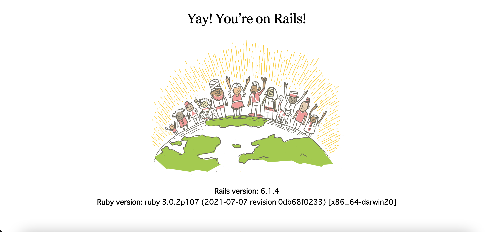

こんにちは。Rails エンジニアになる可能性が出てきたので復習です。  
早くお仕事決まると嬉しいなあ。

#### 環境構築

##### rbenv で ruby の最新安定版を導入

[公式サイト](https://www.ruby-lang.org/ja/downloads/)で確認したバージョンがあるか確認する。  
現時点は 3.0.2 でした。

```bash
$ rbenv install --list
```

もしなければ下記。

```bash
$ brew upgrade rbenv ruby-build
$ rbenv install --list
```

rbenv でインストール

```bash
$ rbenv install 3.0.2
$ rbenv global 3.0.2
```

バージョンを確認

```bash
$ ruby -v
$ which ruby
```

##### RubyGems と Bundler の導入

```bash
$ gem update --system
$ gem -v
$ gem install bundler
```

##### Rails の導入

```bash
$ gem install rails -v 6.1.4
$ rails -v
```

##### MySql の導入

導入については[こちら](https://prog-8.com/docs/mysql-env)。  
バージョン確認だけ。

```bash
$ mysql --version
```

#### プロジェクト作成

意外と mysql で構築する手順の新しいものが見つからない。。。

```bash
$ rails new [アプリ名] -d mysql
$ cd [アプリ名]
```

##### db 設定

```yml
default: &default
  adapter: mysql2
  encoding: utf8mb4
  pool: <%= ENV.fetch("RAILS_MAX_THREADS") { 5 } %>
  username: root
  password: ****   // ここにパスワードを設定
  socket: /tmp/mysql.sock

development:
  <<: *default
  database: rank_d_test_development
```

#### エラー

開発ディレクトリで rails コマンドが使えない。  
mysql が原因らしい。[この記事](https://qiita.com/kuropp/items/af1d7ee76d0c1417dd78)のとおりにしたらなおった。  
魔法のコマンドでしたね。

```bash
$ rails -v

/Users/[ユーザによる]/bin/spring:5:in `<top (required)>': undefined method `specs' for nil:NilClass (NoMethodError)
        from bin/rails:2:in `load'
        from bin/rails:2:in `<main>'
```

#### ひとまず起動してみる

db をセットアップして、ひとまずサーバを起動してみます。  
ここではローカルの bin/rails ではなく rails コマンドでやってますが特に深い意味はないです。

```bash
$ rails db:create
$ rails s
```

##### またしてもエラー

```bash
Exiting
/Users/[ユーザ名]/.rbenv/versions/3.0.2/lib/ruby/gems/3.0.0/gems/webpacker-5.4.0/lib/webpacker/configuration.rb:103:in `rescue in load': Webpacker configuration file not found /Users/[ユーザ名]/Documents/environment_rails/rank_d_test/config/webpacker.yml. Please run rails webpacker:install Error: No such file or directory @ rb_sysopen - /Users/[ユーザ名]/Documents/environment_rails/rank_d_test/config/webpacker.yml (RuntimeError)

```

webpacker がいないとのこと。[この記事](https://qiita.com/NaokiIshimura/items/8203f74f8dfd5f6b87a0)のとおりにインストールしたら正常に起動しました。

```bash
$ rails webpacker:install
$ rails s
=> Booting Puma
=> Rails 6.1.4 application starting in development
=> Run `bin/rails server --help` for more startup options
Puma starting in single mode...
* Puma version: 5.3.2 (ruby 3.0.2-p107) ("Sweetnighter")
*  Min threads: 5
*  Max threads: 5
*  Environment: development
*          PID: 46474
* Listening on http://127.0.0.1:3000
* Listening on http://[::1]:3000
Use Ctrl-C to stop
```

#### やっと起動しました

めでたしめでたし



#### ついでに bootstrap を導入しとく

Gemfile の末尾に追加

```yml:title=Gemfile
gem 'bootstrap'
```

bundle でインストール

```bash
$ bundle
```

css ファイルに設定

```css:title=app/assets/stylesheets/application.css
@import 'bootstrap';
```

#### 参考

- [Ruby](https://www.ruby-lang.org/ja/downloads/)

- [rbenv を利用して Ruby のバージョンを最新安定版にする](https://qiita.com/jiko797torayo/items/0cf40f100b5e3354fd67)

- [MySQL の開発環境を用意しよう（macOS）](https://prog-8.com/docs/mysql-env)

- [【Rails/MySQL】Rails に MySQL を導入する方法【プログラミング学習 149 日目】](https://qiita.com/fuku_tech/items/a380ebb1fd156c14c25b)

- [【Ruby on Rails】MySQL 構築からデータベース変更まで](https://qiita.com/japwork/items/d5c9dcce0d14921bd57f#%E6%96%B0%E8%A6%8F%E3%82%A2%E3%83%97%E3%83%AA%E3%82%92mysql%E3%81%AB%E8%A8%AD%E5%AE%9A)

- [Rails の DB を mysql にするときにでるエラーを解決する魔法のコマンド](https://qiita.com/kuropp/items/af1d7ee76d0c1417dd78)

- [Rails6 開発時につまづきそうな webpacker, yarn 関係のエラーと解決方法](https://qiita.com/NaokiIshimura/items/8203f74f8dfd5f6b87a0)
