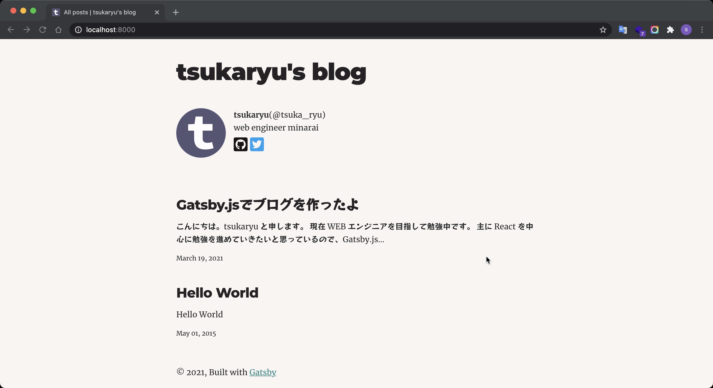
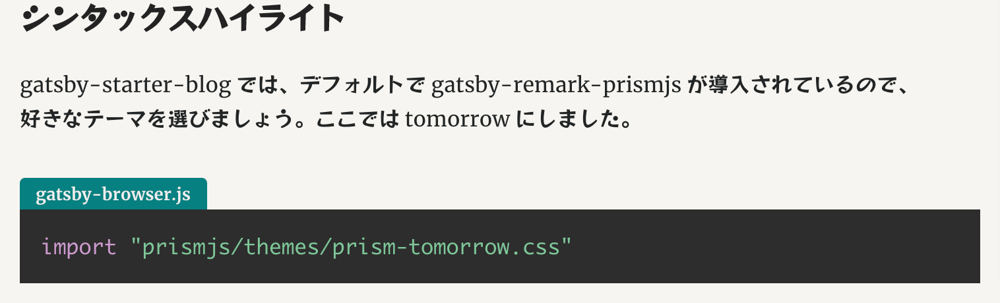

こんにちは。tsukaryu と申します。
現在 WEB エンジニアを目指して勉強中です。

主に React を中心に勉強を進めていきたいと思っているので、Gatsby.js でブログを作ってみました。
今後は、学習内容を自分の備忘録的にこのブログにまとめていければ良いなと思っています。



### ブログの構成

##### Gatsby.js✕Netfily

技術選定というか、ツールその他周りについて。  
React を使いたいので、Gatsby.js か Next.js かでしたが、ひとまず SSG なので、Gatsby.js でよいかなというふわっとした感じです。

最初は構成として、Gatasby.js✕Contentful✕Netfily を考えていましたが、markdown で書いてみたかったのと、Contentful を噛ます理由も特になかったので、Gatsby.js✕Netfily で、github と連携させればそれで良いかなと思いました。

かんたん設定ですぐにデプロイできるので、Netfily すごいですね。

### ブログのデザインを少しだけカスタマイズ

#### Gatsby.js のテンプレート

[gatsby-starter-blog](https://github.com/gatsbyjs/gatsby-starter-blog)というブログのテンプレートを使用しています。  
本当は[gatsby-starter-blog-no-styles](https://github.com/noahg/gatsby-starter-blog-no-styles)で CSS を書いていきたかったのですが、手元の環境だと clone してもうまくいかず、そこに時間をかけても仕方がないので、ひとまず安定のテンプレートにしました。

#### テーマカラー

[Happy Hues](https://www.happyhues.co/)でポップで見やすい色を選択。  
このブログは palettes 8 です。

#### FontAwesome

[公式](https://www.gatsbyjs.com/docs/recipes/styling-css/#using-font-awesome)のとおりにインストールして、すぐに使えるようになりました。

1. react-fontawesome をインストール

```bash:title=zsh
$ npm install @fortawesome/fontawesome-svg-core  @fortawesome/free-brands-svg-icons @fortawesome/react-fontawesome
```

2. FontAwesomeIcon component をインポートし、アイコンを指定

```js:title=bio.js（抜粋）
import * as React from "react"
import { FontAwesomeIcon } from "@fortawesome/react-fontawesome"
import {
  faGithubSquare,
  faTwitterSquare,
} from "@fortawesome/free-brands-svg-icons"

const Bio = () => {
  return (
    <FontAwesomeIcon
      icon={faGithubSquare}
      className="fa-2x"
      style={{
        marginTop: "5px",
        marginRight: "5px",
        color: "#171515",
      }}
    />
  )
}

export default Bio
```

#### GoogleFont

これも[公式](https://www.gatsbyjs.com/docs/recipes/styling-css/#using-google-fonts)を参考にサクッと導入可能です。フォントは[ここ](https://github.com/fontsource/fontsource/tree/master/packages)から選びましょう。  
英語フォントはデフォルトが可愛いのでよかったのですが、日本語フォントが気に入らないので、"RocknRoll One"を導入することにしました。癖があって読みにくくていいですね。

```bash:title=zsh
$ npm install @fontsource/rocknroll-one
```

```css:title=style.css(抜粋)
--fontFamily-sans: Montserrat, "RocknRoll One";
--fontFamily-serif: "Merriweather", "RocknRoll One";
```

#### シンタックスハイライト

gatsby-starter-blog では、デフォルトで gatsby-remark-prismjs が導入されているので、  
好きなテーマを選びましょう。ここでは tomorrow にしました。

```js:title=gatsby-browser.js
import "prismjs/themes/prism-tomorrow.css"
```

スニペットのタイトルをつけたかったので、gatsby-remark-code-titles を導入しました。  
公式に記載されている通り、一番頭に持ってこないとうまく動作しないのかな。  
突然うまくいきだしたので何が原因かわからない。。。

```js:title=gatsby-config.js
 resolve: `gatsby-transformer-remark`,
      options: {
        plugins: [
          {
            resolve: 'gatsby-remark-code-titles',
            options: {
            },
          },
        ]
      }
```

タイトルのスタイリングと、余計なマージンを除いて完成。

```css:title=style.css
.gatsby-code-title {
  background: var(--color-primary);
  color: #eee;
  padding: 6px 12px;
  font-size: 0.8em;
  line-height: 1;
  font-weight: bold;
  display: table;
  border-radius: 4px 4px 0 0;
}

pre[class*="language-"] {
  padding: 1em;
  margin: 0;
  overflow: auto;
}
```

はい、いい感じになったのではないでしょうか。



#### 最後に
今回はここまでです。手を加えたいポイントは下記のとおりです。
- トップのヒーローイメージ
- ナビバー追加
- タグの実装
- ダークモード
- 記事のレイアウトもうちょい見やすくする

#### 参考

- [Gatsby と Netlify で簡単にブログを作成](https://qiita.com/k-penguin-sato/items/7554e5e7e90aa10ae225).
- [Gatsby.js で、爆速なええ感じのブログを作るまで](https://kyabe.net/blog/making-blog-with-gatsbyjs/)
- [Gatsby にシンタックスハイライトを入れてコードをきれいに表示する](https://littlebylittle.work/2020/01/gatsby-syntax-highlighting/)
