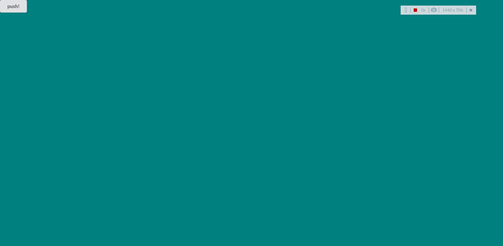
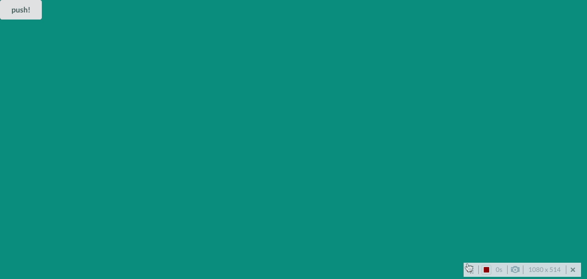

こんにちは。今回は React でのアニメーションについてです。  
これまで、React の学習のため、Udemy でいくつか講座を購入してぼちぼちやっておりましたが、  
一通り修了したため、復習をしながら自分の練習用のサイトをいくつか作りたいと思っています。

まずはいわゆるポートフォリオ？自己紹介？的なサイトを作りたいのですが、  
React でアニメーションを動かした経験がないので、調べながらいくつかプロトタイプを作ってみたいと思います。

#### react-spring

今回は react-spring というライブラリを使用してアニメーションを作成していきます。  
React Hooks ベースなのでスッキリかけそうだなという感じです。  
選択肢は react-motion や React Transition Group など他にもいろいろあるようです。  
それにしても、react-spring は公式サイトが激重なのが気になるところです。。。

#### 今回作りたいアニメーション

ひとつずつやっていきます。

- 文字のアニメーション
- 画像のカバースライド
- ヒーロースライダー
- 上記＋スクロールしたらふわっと出現

#### 文字アニメーション

##### useSpring

まずは、react-spring の useSpring というもっとも基本的な Hooks を利用して作成します。  
完成品は下記のとおりです。  
なお、大まかな流れは下記のとおりです。

1. import する
2. useSpring でアニメーションのプロパティを定義
3. animated コンポーネントを定義



それでは、個別に見ていきましょう。

1. import する  
   useSpring と animated を import します。  
   animated は毎回使うので、useSpring の部分が Hooks ごとに変わります。

```js:title=LetterAnimation.js（抜粋）
import { useSpring, animated } from "react-spring";
```

2. useSpring でアニメーションのプロパティを定義  
   useSpring の中で、アニメーション開始時と終了時の値を設定をしています。  
   ここでは transform と opacity だけですが、様々な値を取ることができます。  
   また、useState で定義している enter をトリガーとしてアニメーションを制御します。

```js:title=LetterAnimation.js（抜粋）
const [enter, setEnter] = useState(false);
const spring = useSpring({
    transform: enter ? "translateY(0)" : "translateY(-100px)",
    opacity: enter ? 1 : 0,
});
```

3. animated コンポーネントを定義  
   animated の style の部分に、定義したアニメーションの設定を渡します。  
   この場合は span タグとしていますが、他のタグも使用可能です。

```js:title=LetterAnimation.js（抜粋）
<animated.span className='char' style={spring}>
  ANIMATION
</animated.span>{" "}
```

4. 完成  
   完成した全体のソースは下記のとおりです。  
   CSS でゴリゴリアニメーションを記載するよりシンプルでいいですね。  
   スタイルもあわせて記載しておきます。

```js:title=LetterAnimation.js
import React, { useState } from "react";
import { useSpring, animated } from "react-spring";   //1. import する
import { Button } from "semantic-ui-react";
import "./LetterAnimation.css";

export default function LetterAnimation() {
  const [enter, setEnter] = useState(false);
  const spring = useSpring({    //2. useSpring でアニメーションのプロパティを定義
    transform: enter ? "translateY(0)" : "translateY(-100px)",
    opacity: enter ? 1 : 0,
  });
  return (
    <>
      <Button
        className='Button'
        content='push!'
        onClick={() => setEnter(!enter)}
      />
      <div className='container'>
        <div className='animate-title'>
          <animated.span className='char' style={spring}>   {/*3. animated コンポーネントを定義*/}
            ANIMATION
          </animated.span>{" "}
        </div>
      </div>
    </>
  );
}

```

```css:title=LetterAnimation.css
.Button {
  position: absolute;
  left: 0;
  right: 0;
  margin: auto;
  z-index: 2;
}
.container {
  position: relative;
  height: 100vh;
  background-color: teal;
}
.animate-title {
  position: absolute;
  top: 50%;
  left: 50%;
  transform: translate(-50%, -50%);
  color: white;
  font-size: 5em;
}

.char {
  display: inline-block;
}

```

##### useSprings

次に、useSprings をつかって、文字ごとに異なるアニメーションを実装してみます。  
基本的な流れは先程と同様です。



1. import する  
   import は変わらずです。

```js:title=LettersAnimation.js（抜粋）
import { useSprings, animated } from "react-spring";
```

2. useSpring でアニメーションのプロパティを定義  
   下記の手順で、アニメーション値を設定します。

   ```
   - ANIMATION を分割した配列 letters を用意
   - letters を map して、個別のアニメーション値を items に定義
   - map の index を利用して、それぞれの delay の値=index * 100msを定義（delay 以外は同じ）
   - useSprings(個数, 設定値)として定義
   ```

   ただ、いまいちトリガーの設定の仕方がわからないので、
   from と to がほぼ同一内容で、to の中に enter が入り込むおかしな書き方になってます。
   ただしい書き方がわからない。。。

```js:title=LettersAnimation.js（抜粋）
const letters = ["A", "N", "I", "M", "A", "T", "I", "O", "N"];
const items = letters.map((_, index) => ({
    to: {
      transform: enter ? "translateY(0)" : "translateY(-100px)",
      opacity: enter ? 1 : 0,
    },
    from: {
      transform: "translateY(-100px)",
      opacity: 0,
    },
    delay: index * 100,
}));
const springs = useSprings(
    letters.length,
    items.map((item) => item)
);
```

3. animated コンポーネントを定義  
   `springs` に対して、`map` してそれぞれ props を定義しています。  
   文字は、letters にインデックスを添えることで、表示しています。  
   これもかなりスッキリかけていい感じですね。

```js:title=LettersAnimation.js（抜粋）
springs.map((props, index) => (
            <animated.span className='char' style={props} key={index}>
              {letters[index]}
            </animated.span>
))
```

4. 完成  
   完成です。  
   CSS は先程と同じなので割愛します。

```js:title=LettersAnimation.js（抜粋）
import React, { useState } from "react";
import { useSprings, animated } from "react-spring";
import { Button } from "semantic-ui-react";
import "./LettersAnimation.css";

export default function LettersAnimation() {
  const [enter, setEnter] = useState(false);
  const letters = ["A", "N", "I", "M", "A", "T", "I", "O", "N"];
  const items = letters.map((_, index) => ({
    to: {
      transform: enter ? "translateY(0)" : "translateY(-100px)",
      opacity: enter ? 1 : 0,
    },
    from: {
      transform: "translateY(-100px)",
      opacity: 0,
    },
    delay: index * 100,
  }));
  const springs = useSprings(
    letters.length,
    items.map((item) => item)
  );

  return (
    <>
      <Button
        className='Button'
        content='push!'
        onClick={() => setEnter(!enter)}
      />
      <div className='container'>
        <div className='animate-title'>
          {springs.map((props, index) => (
            <animated.span className='char' style={props} key={index}>
              {letters[index]}
            </animated.span>
          ))}
        </div>
      </div>
    </>
  );
}
```

#### 最後に

ひとまず、文字アニメーションについてはやりたかったことができたので、本日は終了です。  
なかなか書き方がわからなくて苦戦中ですが、  
Example を見るとかっこいいアニメーションが多いので、ガシガシ使っていきたいです。  
次回は画像のカバースライドアニメーションを実装したいと思います。  
それにしても、ちょっと記事を書くだけでとても骨が折れますね。。。

#### 参考

- [The top 5 React animation libraries compared](https://blog.logrocket.com/the-top-5-react-animation-libraries-compared/).
- [react-spring](https://www.react-spring.io/).
- [React-Spring の Hooks API でブラウザアニメーションを基本から極めよう!](https://qiita.com/uehaj/items/260f188851045cc091ac).
- [【JavaScript＆CSS】ガチで学びたい人のための WEB 開発徹底実践（フロントエンド編）](https://www.udemy.com/course/front-dev-tutorial/).
  ※今回のアニメーションを CSS で作成している Udemy の講座です
